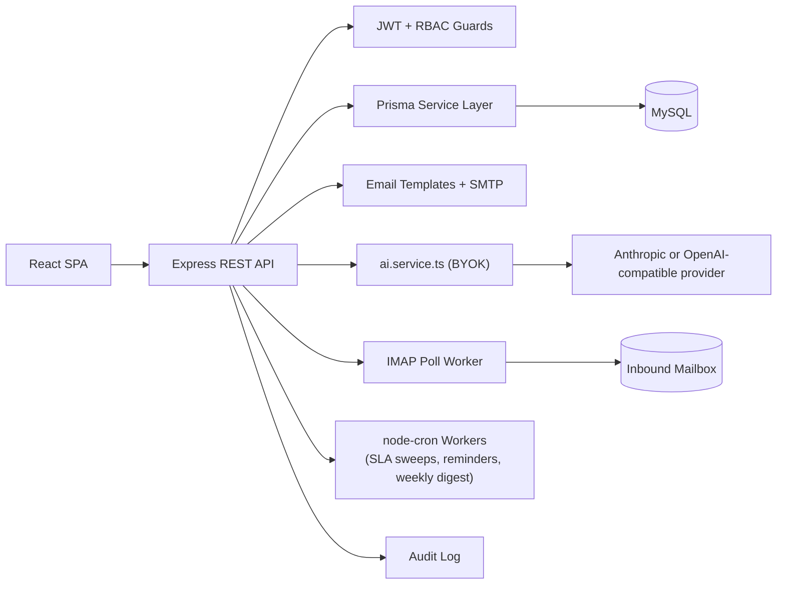
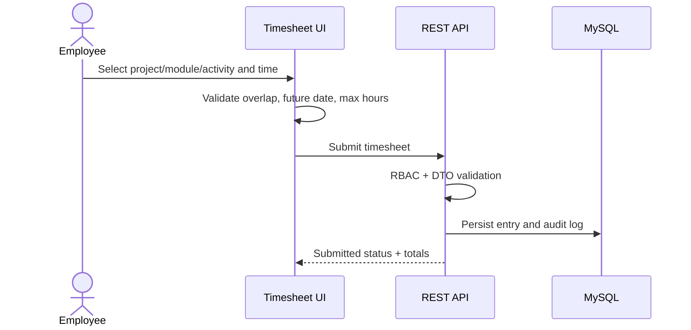
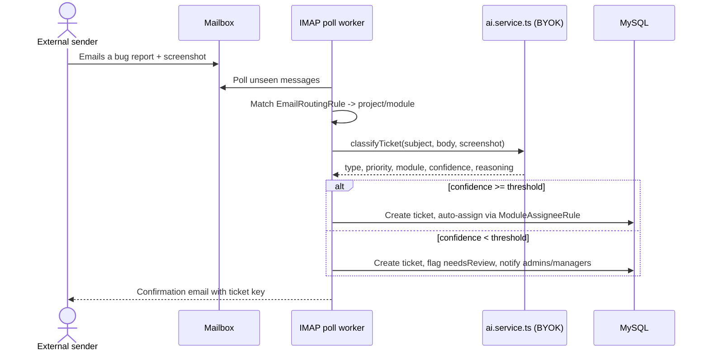

# TimeSphere — Timesheet + AI-Powered Ticketing Portal

A full-stack workspace platform that combines **timesheet management** (daily work logging,
approvals, SLA-driven escalation, reporting) with a **Jira-like ticketing system**, a
**bring-your-own-key AI layer** (Anthropic or any OpenAI-compatible provider), and an
**analytics/insights dashboard** — all under one roof, one login, and one admin-configurable
settings surface. The unifying idea: this app already owns both *the work* (tickets) and *the
time spent on it* (timesheets), so features that fuse the two (workload heatmaps, AI weekly
digests) are only possible because they live in the same system.

## Feature areas

| Area | What it does |
|---|---|
| **Timesheets** | Daily time entry against project/module/submodule/activity, manager approval workflow, SLA-driven escalation up the reporting chain, daily reminder + next-morning escalation emails, CSV/PDF export. |
| **Ticketing** | Bugs/tasks/improvements with admin-editable types & labels, priority/status workflow (with a Kanban board and drag-and-drop), assignment, comments, attachments, watchers, cross-ticket links (Blocks/Duplicate of/Relates to), sub-task checklists, SLA due-dates with automatic breach escalation. Tickets and timesheets link to each other — time can be logged directly against a ticket. |
| **AI, BYOK multi-provider (opt-in)** | Auto-triage suggestions on ticket creation, duplicate-ticket detection, a writing assistant ("Improve with AI") for descriptions/comments, AI comment-thread summaries, natural-language "Ask AI" search over the ticket backlog (command palette), and a Monday-morning AI-authored weekly digest email. Every capability is gated behind a master switch **and** its own per-feature toggle in Workspace Settings — nothing calls out to any provider until an admin explicitly turns it on and a key is configured. **Bring-your-own-key**: pick Anthropic (native) or any OpenAI-compatible provider — OpenAI, Groq, Mistral, DeepSeek, OpenRouter, Gemini, Qwen, Kimi, Nvidia NIM, a local Ollama/LM Studio install, or a custom endpoint — from Workspace Settings → AI; the key is encrypted at rest and never returned to the client. Every AI call is cost-estimated and logged (`AIUsageLog`) against a configurable monthly budget cap. |
| **Email-to-ticket intake** | Point an IMAP mailbox at the app; inbound bug-report emails (including screenshot attachments, read directly by the configured model's vision input) are auto-classified into a properly-typed, prioritized, project/module-routed ticket, auto-assigned via admin-configured rules, and the sender gets an automatic confirmation reply. Untrusted email content is delimited and instructed as data-not-instructions before it reaches the model, and its self-reported confidence is capped before it can suppress human review. Low-confidence classifications are flagged **needs review** instead of silently mis-assigned. An **AI Activity Log** page shows every AI-touched ticket with a thumbs up/down feedback control. |
| **Insights & analytics** | Ticket velocity, SLA compliance trend, cycle-time distribution, bug hotspots by module, a per-assignee workload heatmap, estimate-vs-actual variance, reopen rate, and first-response time — plus two opt-in-and-off-by-default panels (cost-per-ticket, team leaderboard) since they touch compensation-adjacent or individually-ranked data. |
| **Admin configurability** | Nearly everything above is editable from **Workspace Settings** without a server restart: notification channels & reminder schedule, ticket SLA hours per priority, ticket types, labels, AI provider/toggles/model/budget, email-intake mailbox connection + routing rules + module-assignee rules, and per-notification-category email opt-ins. |
| **RBAC & audit** | Role-based permissions (`SUPER_ADMIN` / `ADMIN` / `MANAGER` / `TEAM_LEAD` / `EMPLOYEE`), a tamper-evident audit log of every administrative/approval/AI action, and a per-ticket Activity tab that's just that same audit log filtered to one entity. |
| **Session management & security** | httpOnly, `SameSite=Lax` refresh-token cookie (never exposed to page JS) with rotation-and-reuse-detection, a per-user active-sessions list with per-device or "sign out everywhere" revocation, per-account login lockout on top of per-IP rate limiting, a real hashed/expiring/single-use password-reset flow, AES-256-GCM encryption at rest for stored secrets (IMAP password, BYOK API keys), and a fully responsive layout (phone through 4K) verified by an automated Playwright suite. See [Security](#security) below for the full VAPT assessment. |

## Stack

- **Frontend**: React 19, TypeScript, Vite, TailwindCSS, shadcn-style Radix components, Zustand, TanStack Query, React Hook Form, Framer Motion, Recharts, `@dnd-kit` (Kanban drag-and-drop), Tiptap (rich text)
- **Backend**: Node.js, Express 5, TypeScript, JWT access/refresh auth (httpOnly-cookie rotation, session revocation), RBAC, Prisma ORM, MySQL, `@anthropic-ai/sdk` + `openai` (BYOK multi-provider adapter), `imapflow` + `mailparser` (email intake), `node-cron` (background workers), Nodemailer
- **Infra**: Docker Compose, environment config validation (Zod) with production-safety boot checks, secure headers (Helmet), rate limiting + per-account login lockout, request logging, centralized error middleware, AES-256-GCM encryption at rest for stored secrets
- **Testing**: Playwright (Chromium, custom phone/tablet/laptop/desktop/4K viewport projects) — end-to-end auth, tickets, timesheet, settings, and responsive-layout coverage

This is an npm-workspaces monorepo:

```text
apps/
  api/      Express API — controllers (one per resource), services (business logic +
            external integrations), workers (cron jobs: SLA sweeps, reminders, email
            intake polling, weekly digest), middleware, Prisma schema + migrations
  web/      React app — pages, layouts, reusable components, Zustand stores, the typed
            API client (services/api.ts)
packages/
  shared/   Shared TypeScript contracts/constants (permissions, status enums, shared
            interfaces) — built to dist/, imported by both api + web so the two never
            drift out of sync on a shape
docs/
  API.md
  DATABASE.md
  DEPLOYMENT.md
```

### Why the code is organized this way

- **Controllers stay thin; services own the logic.** A controller's job is auth/permission
  gates, request validation (Zod), and wiring a response — the actual business rules (SLA
  math, AI gating, email routing, access-control predicates) live in the matching
  `services/*.ts` file so they can't drift between the two or three routes that need them.
- **One choke point per external integration.** All Anthropic calls go through
  `ai.service.ts`; all outbound email goes through `mail.service.ts`/`notify.service.ts`. This
  is what makes admin toggles, budget caps, and per-category email opt-ins actually
  enforceable — every caller is forced through the same gate.
- **Workers are separate from the request/response cycle.** Anything that should happen on a
  schedule regardless of whether anyone is using the app right now (SLA sweeps, reminders,
  IMAP polling, the weekly digest) is a `node-cron` job in `apps/api/src/workers/`, started
  once from `server.ts` on boot — never something a request handler kicks off inline.

## Prerequisites

- Node.js 20+ (tested with Node v24.12.0 / npm 11.6.2)
- A running MySQL 8 server reachable from your machine (XAMPP's bundled MySQL works fine — default install listens on `localhost:3306` with user `root` and an **empty password**)
- Optional, only if you want AI features live: an API key for whichever provider you choose (Anthropic, OpenAI, Groq, etc. — see **Turning on AI features (BYOK)** below), or a local Ollama/LM Studio install with no key at all
- Optional, only if you want email-to-ticket intake live: IMAP access to a mailbox (an app password works fine, same pattern as the existing SMTP setup)

## Installation (local, no Docker)

1. **Install dependencies** (this also builds `packages/shared`, which both the API and web app import at runtime):

   ```bash
   npm install
   ```

2. **Create the API's env file.** The API loads `.env` from its own working directory (`apps/api/`), not the repo root, so copy the template there:

   ```bash
   cp .env.example apps/api/.env
   ```

   Then edit `apps/api/.env` and set at minimum:
   - `DATABASE_URL` — must match a MySQL server you actually control. For XAMPP's default MySQL: `mysql://root:@localhost:3306/timesheet_portal` (empty password). If your MySQL root user has a password, URL-encode any special characters in it (e.g. `@` → `%40`).
   - `JWT_ACCESS_SECRET` / `JWT_REFRESH_SECRET` — any long random strings for local dev (production deployments get a boot-time entropy/charset check — see [Security](#security)).
   - `ENCRYPTION_KEY` — 64 hex characters (32 bytes), used for AES-256-GCM encryption of stored secrets (IMAP password, BYOK API keys). Generate one with `openssl rand -hex 32`.
   - `SMTP_*` — optional; leave `SMTP_HOST` empty to have emails logged to the console instead of actually sent.
   - `ANTHROPIC_API_KEY` — optional; leave empty to keep the default (Anthropic-provider) AI path inert until either this env var or a BYOK key saved in Workspace Settings is available. AI also needs an admin to flip its master switch on — it never turns itself on. See **Turning on AI features** below for the full BYOK picture.

3. **Make sure MySQL is running** (start it from the XAMPP Control Panel if you're using XAMPP's MySQL).

4. **Generate the Prisma client:**

   ```bash
   npm run db:generate
   ```

5. **Create the database and apply migrations:**

   ```bash
   npm run db:migrate
   ```

   This creates the `timesheet_portal` database (if it doesn't exist) and applies every migration in `apps/api/prisma/migrations`.

6. **Seed demo data:**

   ```bash
   npm run seed
   ```

   Seeds roles/permissions, three demo users (below), a demo project, default ticket types
   (Bug/Task/Improvement), and every notification/ticketing/AI settings singleton at its safe
   default (AI **off** until you opt in).

7. **Run the app:**

   ```bash
   npm run dev
   ```

   - Frontend: http://localhost:5173
   - API: http://localhost:4000/api (health check at http://localhost:4000/health)

   The web dev server proxies `/api` and `/uploads` to the API, so there's no separate URL/CORS config to manage in dev.

### Demo credentials (after seeding)

- Super Admin: `superadmin@timesheet.local` / `Admin@12345`
- Manager: `manager@timesheet.local` / `Admin@12345`
- Employee: `employee@timesheet.local` / `Admin@12345`

### Turning on AI features (BYOK)

AI is off by default, and the underlying model provider is admin-chosen per workspace — bring
your own key for whichever vendor you already have an account with. To try it:

1. Log in as Super Admin → **Workspace Settings → AI**.
2. Pick a **Provider**: Anthropic (native), or any OpenAI-compatible vendor — OpenAI, Groq,
   Mistral, DeepSeek, OpenRouter, Gemini, Qwen, Kimi, Nvidia NIM, a local Ollama/LM Studio
   install (no key needed), or **Custom endpoint** for anything else that speaks the same
   protocol. Picking a preset fills in its base URL; you can still override it.
3. Paste an **API key** and click Save (skip this for a local Ollama/LM Studio install). The key
   is encrypted at rest (AES-256-GCM) and never sent back to the browser once saved — only an
   "is a key saved" flag is. Anthropic alone also honors `ANTHROPIC_API_KEY` in `apps/api/.env`
   as a fallback, so existing deployments keep working unconfigured.
4. Set the **Model** — a dropdown of Claude models for the Anthropic provider, or a free-text
   field for OpenAI-compatible providers (model names vary per vendor, e.g. `gpt-4o-mini`,
   `llama3.1`, `mixtral-8x7b`).
5. Flip the master switch, then whichever per-feature toggles you want (auto-triage, duplicate
   detection, writing assistant, comment summary, "Ask AI", email intake, weekly digest), and
   optionally set a monthly budget cap.
6. For email-to-ticket intake specifically, also fill in the mailbox connection under
   **Workspace Settings → Email intake** and add at least one routing rule (or a fallback
   project) so inbound mail has somewhere to land.

Not every OpenAI-compatible endpoint supports the same structured-output request shape (local
runtimes like Ollama/LM Studio in particular often don't) — triage and duplicate-detection ask
for JSON via the prompt itself when needed and validate the response locally either way, so a
provider that lacks native structured output degrades gracefully instead of hard-failing.

## Docker

```bash
docker compose up --build
```

Docker Compose passes environment variables directly (see `docker-compose.yml`) rather than reading `apps/api/.env`, so export `DATABASE_URL`, `JWT_ACCESS_SECRET`, `JWT_REFRESH_SECRET`, `WEB_ORIGIN`, and `APP_BASE_URL` in your shell (or a `.env` file next to `docker-compose.yml`, which Compose reads automatically) before running it. MySQL runs in its own container on host port `3307`.

## Troubleshooting

- **`Error: Cannot find package '...packages/shared/dist/index.js'`** — `packages/shared` hasn't been built. Run `npm install` (which now runs this automatically via `postinstall`) or manually: `npm run build -w packages/shared`.
- **`Environment variable not found: DATABASE_URL` / zod "Required" errors on boot** — your `.env` is in the wrong place. It must be at `apps/api/.env`, not the repo root.
- **`Authentication failed against database server, the provided database credentials for 'root' are not valid.`** — `DATABASE_URL` in `apps/api/.env` doesn't match your MySQL server's actual root password. For a stock XAMPP install this password is empty.
- **`ENCRYPTION_KEY must be a 64-character hex string` on boot** — generate one with `openssl rand -hex 32` and set it in `apps/api/.env`; this key encrypts stored secrets (IMAP password, BYOK API keys) at rest and has no safe default.
- **Port already in use (4000 or 5173)** — another process is already listening; stop it or change `API_PORT` / the web `--port` flag.
- **AI features show "No API key configured"** — for the Anthropic provider, set `ANTHROPIC_API_KEY` in `apps/api/.env` (or save a key in Workspace Settings → AI); for any other provider, save a key there directly (or leave it blank for a keyless local provider like Ollama/LM Studio). The master switch in Workspace Settings still needs to be turned on separately.
- **Email intake isn't picking anything up** — check three things: the master AI switch **and** the "Email-to-ticket intake" toggle are both on, the mailbox connection test in Workspace Settings → Email intake succeeds, and at least one routing rule or a fallback project is configured (otherwise matched-but-unrouted mail is intentionally dropped, logged as a warning).
- **Logged in but immediately bounced back to `/login` after a refresh** — the refresh token is an httpOnly cookie scoped to `/api/auth`; if you're serving the API and web app from different origins in a custom setup, confirm the API's CORS config allows your origin with `credentials: true` and that the cookie's `Secure` flag (production-only) matches your protocol (HTTPS in production).

## Testing

```bash
npm run test:e2e          # full Playwright suite (Chromium; desktop + phone/tablet/laptop/4K viewport projects)
npm run test:e2e:report   # open the last run's HTML report
```

The suite boots the API and web dev servers itself (see `playwright.config.ts`'s `webServer`
config) if they aren't already running. A one-time `setup` project logs in as each demo role and
saves the resulting session for the other specs to reuse — see `tests/e2e/auth.setup.ts` for why
some specs deliberately log in fresh instead (it comes down to the refresh-token rotation
described in Security below).

## Security

This app has gone through an internal VAPT (Vulnerability Assessment + Penetration Test) pass —
SAST via full source review, DAST via live scripted HTTP probes, plus dependency scanning
(`npm audit`). The full report, with severity ratings, how each issue was found, evidence, and
remediation status, is published as a shareable report:

**[VAPT Assessment Report — TimeSphere Portal](https://claude.ai/code/artifact/068d1cbf-1b5a-4e16-ae9c-c3ca2a1647e1)**

Headline points if you don't read the full report:

- Session handling: httpOnly/`SameSite=Lax` refresh-token cookie, rotation with reuse detection
  (grace-windowed against benign concurrent-tab races), per-session and "sign out everywhere"
  revocation, per-account login lockout, JWTs pinned to `HS256` + issuer/audience.
- File uploads: `.html`/`.svg`/`.js` blocked at the allow-list; every `/uploads` response is
  forced to download (`Content-Disposition: attachment`, `X-Content-Type-Options: nosniff`) as
  defense-in-depth even for allowed types.
- Secrets: AES-256-GCM encryption at rest for the IMAP password and BYOK API keys; a boot-time
  entropy/charset check rejects weak or placeholder `JWT_*`/`ENCRYPTION_KEY` values in production.
- AI input handling: untrusted, unauthenticated email content is explicitly delimited and framed
  as data (not instructions) before reaching the model, and its self-reported confidence is
  capped before it can suppress the human-review gate.
- Dependencies: `npm audit` is clean (0 vulnerabilities) as of the last regression pass.

## Architecture



## Key workflows





## Environment

See `.env.example` for all supported variables. Remember: the actual file the API reads must live at `apps/api/.env` (see Installation step 2 above). Notable groups:

- **Core**: `DATABASE_URL`, `JWT_ACCESS_SECRET`/`JWT_REFRESH_SECRET`, `ENCRYPTION_KEY`, `WEB_ORIGIN`, `APP_BASE_URL`
- **Mail**: `MAIL_FROM`, `SMTP_*` — leave `SMTP_HOST` empty to log emails to the console instead of sending
- **Timesheet SLA**: `SLA_*` — approval-window defaults, seeded into `GlobalNotificationSettings`/project rows, editable per-project after that
- **Ticket SLA**: `TICKET_SLA_*` — resolution-hour defaults per priority, seeded into `GlobalTicketSettings`, editable at runtime from Workspace Settings after that
- **AI**: `ANTHROPIC_API_KEY` — an Anthropic-only fallback key; everything else about AI (which provider, which features are on, model, base URL, BYOK key, budget, confidence threshold) lives in the DB via `GlobalAISettings` and is admin-editable at runtime from Workspace Settings → AI

## Further docs

- [docs/API.md](docs/API.md)
- [docs/DATABASE.md](docs/DATABASE.md)
- [docs/DEPLOYMENT.md](docs/DEPLOYMENT.md)
