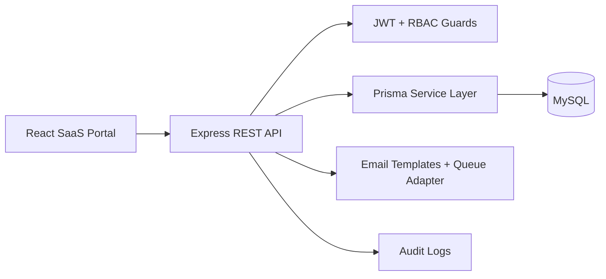
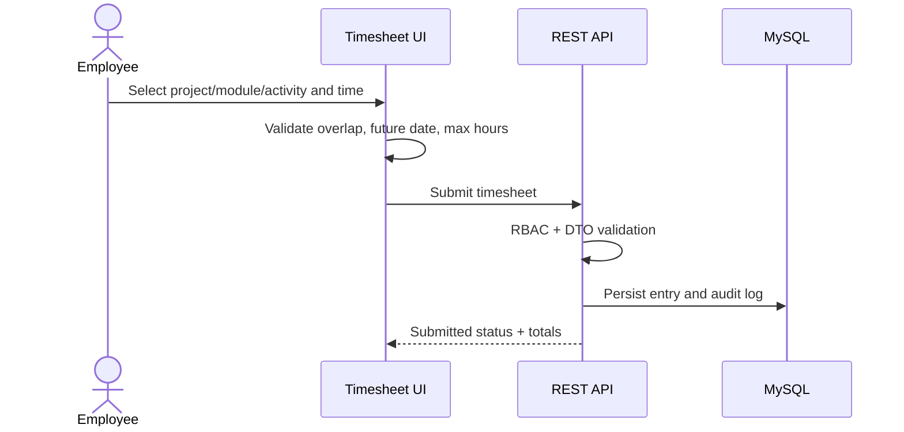

# Enterprise Timesheet Management Portal

Premium full-stack timesheet management application for role-based daily work logging, project activity tracking, dashboards, approvals, notifications, and administration.

## Stack

- Frontend: React, TypeScript, Vite, TailwindCSS, shadcn-style components, Zustand, TanStack Query, React Hook Form, Framer Motion, Recharts
- Backend: Node.js, Express, TypeScript, JWT access/refresh auth, RBAC, Prisma ORM, MySQL
- Infra: Docker Compose, environment config, validation, secure headers, rate limiting, logging, error middleware

## Quick Start

```bash
cp .env.example .env
npm install
npm run db:generate
npm run db:migrate
npm run seed
npm run dev
```

Frontend runs on `http://localhost:5173`.
API runs on `http://localhost:4000/api`.

Demo credentials after seeding:

- Super Admin: `superadmin@timesheet.local` / `Admin@12345`
- Manager: `manager@timesheet.local` / `Admin@12345`
- Employee: `employee@timesheet.local` / `Admin@12345`

## Docker

```bash
docker compose up --build
```

## Architecture



## Key Workflows



## Folder Structure

```text
apps/
  api/      Express API, Prisma, controllers, services, middleware
  web/      React app, pages, layouts, components, stores, services
packages/
  shared/   Shared TypeScript contracts and constants
docs/
  API.md
  DATABASE.md
  DEPLOYMENT.md
```

## Environment

See `.env.example` for all supported variables.

