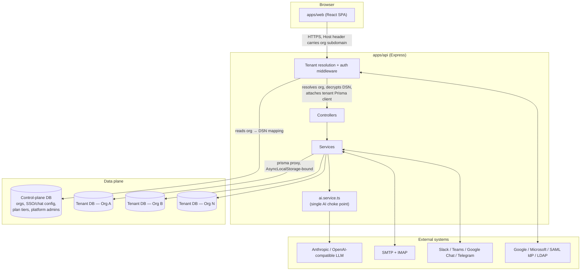
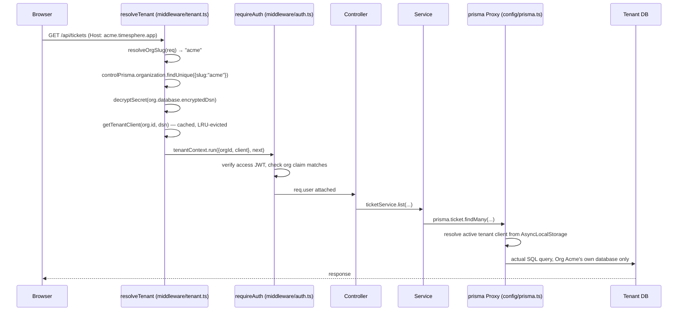
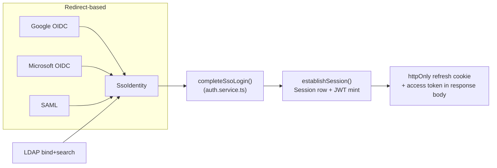
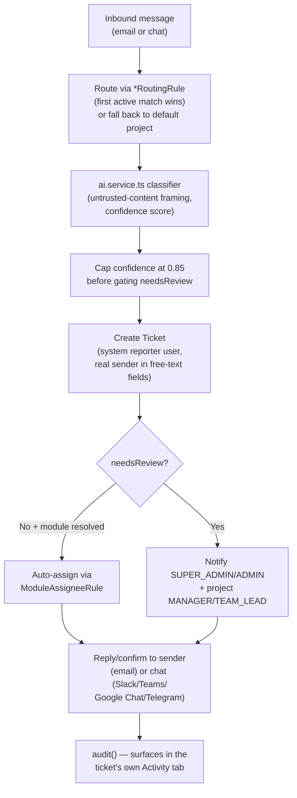
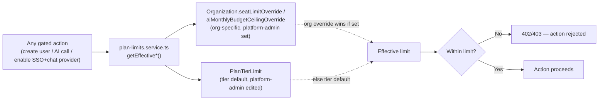
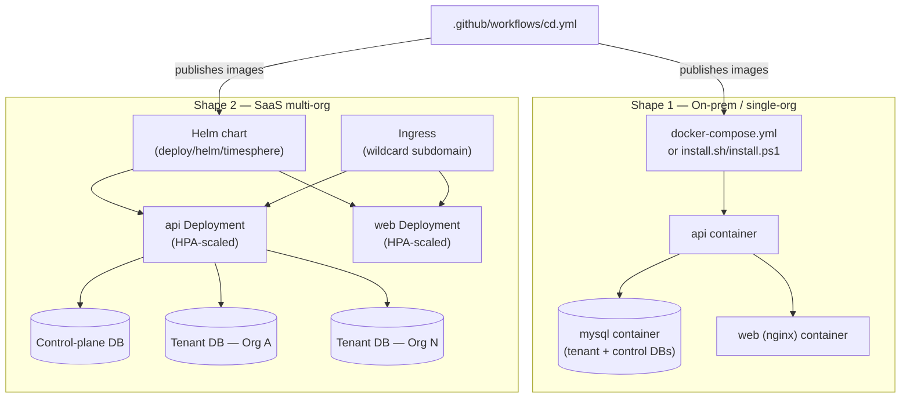

# TimeSphere — Architecture Reference

> **What this file is.** A structured, continuously-maintained map of the codebase: what each
> module is for, why it exists, what it depends on, and how data flows through the system. It is
> written for two audiences at once — a human engineer onboarding onto the project, and an AI
> coding assistant (Claude Code, Cursor, Copilot, etc.) that needs to understand the system
> before changing it. Prefer this document over re-deriving architecture from scratch by reading
> every file.
>
> **How to keep this current (read this before you skip it).** Whenever you add a new
> service/controller/worker, change what a module depends on, or add a new data flow, update the
> relevant section below in the same change. Treat an out-of-date `ARCHITECTURE.md` as a bug.
> Each module entry is deliberately terse (purpose, depends-on, depended-on-by, one "why") —
> that's the format to match when adding a new one, not prose paragraphs.

---

## 1. What this system is

TimeSphere is a **multi-tenant SaaS platform** combining timesheet management, a Jira-like
ticketing system, a bring-your-own-key AI layer, and multi-channel ticket intake (email + four
chat platforms), deployable either as a single-company on-prem install or as a true multi-org
SaaS product on the same codebase.

**The one idea everything else follows from**: every tenant (`Organization`) gets its own
**physically separate MySQL database** — never a shared table filtered by a `tenantId` column.
A small **control-plane database** (`apps/api/prisma/control/schema.prisma`) is the only place
that knows every org exists and where its database lives; it never holds ticket/timesheet
content. This is why the same 30+ controllers/services that were written assuming "the whole
database is my company" needed almost no changes to become multi-tenant — see §3.

---

## 2. Monorepo layout

| Path | Purpose |
|---|---|
| `apps/api` | Express + TypeScript API. Two Prisma schemas: `prisma/schema.prisma` (tenant data) and `prisma/control/schema.prisma` (control plane). |
| `apps/web` | React + TypeScript SPA (Vite). Talks to `apps/api` over `/api/*`. |
| `packages/shared` | Types and constants imported by both `apps/api` and `apps/web` (e.g. `GlobalAISettings`, `ChatPlatform`, permission keys) — the one place a cross-cutting type is defined once instead of drifting between frontend/backend copies. |
| `deploy/helm/timesphere` | Kubernetes Helm chart (see §8). |
| `.github/workflows` | CI (`ci.yml`) and CD (`cd.yml`) — see §8. |
| `docs/` | This file, `DEPLOYMENT.md` (operational how-to), and diagrams. |
| `install.sh` / `install.ps1` | One-click Docker Compose installers (Shape 1 — see §8). |
| `tests/e2e` | Playwright end-to-end suite (repo root — exercises both `apps/api` and `apps/web` together). |
| `apps/api/tests` | Vitest unit (`tests/unit`, mocked, no real DB) + integration (`tests/integration`, real throwaway MySQL) tests, scoped to `apps/api` alone — AI service, Stripe billing, SCIM, face verification. |

---

## 3. Core architectural concepts

### 3.1 Database-per-tenant multi-tenancy

- **Control plane** (`apps/api/prisma/control/schema.prisma`): `Organization`, `OrgDatabase`
  (encrypted DSN), `OrgSsoConfig`, `OrgAuthMethod`, `PlatformAdminUser`/`PlatformAdminSession`,
  `PlanTierLimit`. Nothing here is tenant *content* — only metadata about tenants.
- **Tenant resolution** (`apps/api/src/middleware/tenant.ts`): resolves which org a request
  belongs to from the `Host` header's subdomain (falls back to `DEFAULT_ORG_SLUG` when there's no
  real subdomain — the on-prem shape), decrypts that org's DSN, and wraps the rest of the request
  in an `AsyncLocalStorage` context (`apps/api/src/config/tenant-context.ts`) carrying the active
  tenant's Prisma client.
- **The `prisma` Proxy** (`apps/api/src/config/prisma.ts`): every one of the ~30 existing
  `import { prisma } from "../config/prisma.js"` call sites across controllers/services/workers
  is untouched — `prisma` is a `Proxy` that forwards every property access to whichever tenant
  client is active in the current async context. This is *why* the multi-tenancy conversion
  didn't require touching every file that already used `prisma`.
- **Cron workers have no request to hang tenant resolution off of**, so
  `apps/api/src/workers/run-for-every-org.ts` loops over every `ACTIVE` org from the control
  plane and re-runs the worker's existing body once per org, each inside that org's own tenant
  context — one org's failure is caught and logged, never blocking the rest.

### 3.2 Authentication — 4 SSO methods + password

| Provider | Mechanism | Key file |
|---|---|---|
| Password | bcrypt hash + JWT access/refresh, httpOnly cookie rotation | `services/auth.service.ts` |
| Google / Microsoft | OIDC redirect, PKCE, org identity travels in a signed `state` JWT (not the callback URL, which is one fixed URL shared by every org) | `services/sso.service.ts` |
| SAML | IdP-initiated POST binding to a per-app-fixed ACS URL, org identity in `RelayState` | `services/sso.service.ts` |
| LDAP / Active Directory | Direct bind (no redirect) — service-account bind + search, then rebind as the found DN to verify the password | `services/sso.service.ts` (LDAP section) |

All four converge on the same tail: `completeSsoLogin`/`login` → `establishSession` (session row +
JWT mint) in `services/auth.service.ts`. Every access/refresh token carries an `org` claim
cross-checked against the tenant the request resolved to — defense-in-depth, not the primary
isolation boundary (the separate physical databases are).

### 3.3 The AI layer — one choke point

`apps/api/src/services/ai.service.ts` is the **only** place that knows how to call an LLM.
Every capability (`classifyTicket`, `classifyChatMessage`, `findDuplicateTickets`, writing
assistant, comment summary, workspace search, weekly digest) goes through `preflight(feature)` →
`callChat(settings, params)`. `preflight` enforces: the workspace-wide `aiEnabled` switch, the
specific feature's own toggle, and the **effective AI budget** (`min(org's own budget, plan-tier
ceiling)`, re-read on every call so a platform admin lowering a tier's ceiling takes effect
immediately, not after some reconciliation job). `callChat` branches on `GlobalAISettings.provider`
(`ANTHROPIC` native API, or `OPENAI_COMPATIBLE` via the `openai` SDK for every other vendor) —
no capability function knows or cares which is active.

### 3.4 External-content intake pipelines (email + chat)

Both `services/email-intake.service.ts` and `services/chat-intake.service.ts` follow the same
shape: **route → classify → create → confidence-gate → reply/confirm → audit**. A routing rule
(`EmailRoutingRule` / `ChatRoutingRule`) decides which project a message belongs to; the AI
classifier's confidence is capped at `EXTERNAL_INTAKE_CONFIDENCE_CEILING` (0.85, in
`ai.service.ts`) before it's allowed to suppress human review — a single self-reported number
from unauthenticated external content should never be able to fully bypass review, even before
considering prompt injection. Both pipelines create the ticket under a dedicated system "reporter"
user (`EMAIL_INTAKE_SYSTEM_EMAIL` / `CHAT_INTAKE_SYSTEM_EMAIL`) since `Ticket.reporterId` needs a
real `User` row, while the real sender lives in separate free-text fields
(`externalReporterEmail`/`externalChatUserId` etc.).

### 3.5 Plan-tier enforcement

`services/plan-limits.service.ts` re-reads (never caches) an org's effective seat limit, AI
budget ceiling, allowed SSO providers, and allowed chat platforms on every relevant check —
seat creation, AI calls, and the "enable this provider/platform" toggle in Workspace Settings.
Enforced live, not just validated once at signup, so a platform admin's change takes effect on
the very next request.

### 3.6 Platform-admin console

A structurally separate admin surface (`/platform-admin`, own JWT secret
`PLATFORM_ADMIN_JWT_SECRET`, own `PlatformAdminUser` table that doesn't exist in any tenant
database — a compromised tenant DB can never yield platform credentials). Manages org lifecycle,
plan-tier limits, and cross-org analytics. `services/platform-admin-analytics.service.ts` is the
**sole file in the codebase allowed to loop over every tenant database**, and is restricted by
convention to aggregate/count queries — never row-level ticket/comment content. That convention
is the concrete, auditable point where the "no cross-tenant data leakage" guarantee either holds
or doesn't.

### 3.7 Face (identity) verification — server-authoritative by construction

Optional, off by default, Enterprise-tier gated. Confirms the person submitting a
timesheet/ticket — or moving a ticket through its workflow, or **approving** a timesheet — is
the account holder. Four design constraints drive the whole shape of it:

1. **Every decision is made server-side.** The browser only uploads JPEGs — there is no
   face-matching code in the web bundle at all. This is not a performance choice: a client that
   decides its own verification outcome is not a security control, because any employee could
   POST a "passed" result from devtools. `services/face.service.ts` owns detection, anti-spoof,
   liveness, pose measurement, and comparison.
2. **Anti-spoof is checked BEFORE the match.** Otherwise holding a printed photo of the right
   colleague up to the webcam passes on similarity alone — the exact attack the feature exists
   to stop.
3. **A passed check is a single-use, short-lived token.** `POST /api/face/verify` returns a
   `verificationId` that `consumeVerification()` redeems at submit time — same user, same
   context, not already spent, not expired. A conditional `updateMany` arbitrates concurrent
   double-submits, so exactly one wins. Gates on CREATE routes consume *before* the row exists
   and bind the attempt to it afterwards (`bindVerificationToRecord`) — that binding is what
   the "Identity verified" badges join on.
4. **Anti-injection is challenge–response, not frame forensics.** A virtual camera replaying a
   recorded video defeats per-frame anti-spoof honestly (each frame IS a live-looking face). So
   the server issues a random head-movement instruction (single-use, 90s) and measures the
   actual pose delta between a neutral and a gesture frame — a movement chosen *after* the
   recording existed is the one thing a replay cannot perform. Device-label and
   network-novelty heuristics are recorded as review *signals*, never verdicts (both are
   client-influenced and spoofable; a suspected virtual camera flags the attempt for human
   review even when it passes).

**The plan entitlement splits its failure directions deliberately**
(`plan-limits.service.ts#isFaceVerificationAllowed`): configuration/enrollment/verification
fail **closed** (403 — no new biometric collection without the entitlement), while enforcement
on submissions fails **open** (`isFaceVerificationRequired` returns false) — a lapsed payment
must stop *demanding* checks, not lock a workforce out of logging time. Downgrade data handling
(30-day grace, then purge) lives in the retention worker.

Biometric data is treated as its own category throughout: templates are AES-256-GCM encrypted
(same helper as API keys), and captured images live **outside** the public `/uploads` static
mount — that mount has no authentication at all, so anything under it is world-readable to
anyone who guesses a filename. Face imagery is served only by `GET /api/face/image/...`, which
checks session, tenant, and subject-or-admin, and is stored org-scoped
(`face/<orgId>/<userId>/`) so an org's imagery can be purged as a directory.
`workers/face-retention.worker.ts` runs the whole daily lifecycle — image retention, downgrade
grace/purge, enrollment reminders, overdue-review nudges, challenge cleanup — because a policy
nothing enforces is just a document; `workers/identity-weekly-digest.worker.ts` sends admins
the deterministic Monday recap (no AI writes emails about named employees' identity checks).

See [FACE_VERIFICATION.md](FACE_VERIFICATION.md) for calibration, thresholds, the threat-model
table, and the regulatory obligations (GDPR Art.9, Illinois BIPA, India DPDP) it carries.

### 3.8 Maintenance mode — one gate, fails open, super admin exempt

A SUPER_ADMIN schedules a window (start/end/message) from Workspace Settings → Maintenance;
while the window is **active**, every non-SUPER_ADMIN is locked out. Four decisions define the
design (`services/maintenance.service.ts`):

1. **One enforcement choke point, two doors.** The active-check runs inside `requireAuth`
   (covers every authenticated route — nothing to remember to mount) and inside
   `establishSession` (covers every login method: password, Google, Microsoft, SAML, LDAP —
   they all terminate there, so none can become the forgotten side door). Rejection is
   **503 + `code: "MAINTENANCE"`**, never 401: the client must distinguish "your session is
   bad" (refresh, re-login) from "the workspace is closed" (show `/maintenance`, stop retrying).
2. **The check is cached (10s per tenant) and FAILS OPEN.** It sits on the hottest path in the
   app; uncached it would add a query to every call for a value that changes a handful of times
   a year. And a broken settings lookup must degrade to "app works normally" — never to
   "everyone is locked out by an exception". The settings PATCH invalidates the cache so a
   toggle is enforced immediately, not after the TTL.
3. **"Online" means `Session.lastSeenAt` within 15 minutes** — stamped by a throttled
   (5-min, in-memory, fire-and-forget) write in `requireAuth`, not `expiresAt`, which would
   count everyone who logged in this month. The admin panel shows people, not sessions
   (multi-tab dedup). Force-logout is server-side revocation of every non-SUPER_ADMIN session:
   next request 401s → refresh fails → login is refused (maintenance) → `/maintenance` page.
   The chain needs zero client cooperation, which is what makes it a control.
4. **`GET /api/maintenance/status` is public** (tenant-resolved, rate-limited 30/min): the
   people who most need it are exactly those whose tokens were just revoked. It exposes only
   what the lockout page renders — phase, window, message — and only while the mode is enabled.

The SUPER_ADMIN exemption is deliberate and minimal: someone has to do the maintenance, verify
the result, and switch it off. The "warn users" action (in-app + email to online non-admins) is
gated by its own notification toggle (`emailMaintenanceScheduled`) like every other category.

---

## 4. Request lifecycle (a normal, tenant-resolved API call)

## 5. SSO / webhook routes that bypass normal tenant resolution

A handful of routes are mounted **before** `app.use("/api", resolveTenant)` in `apps/api/src/app.ts`
because they can't rely on subdomain resolution:

| Route prefix | Why it's special | Handled in |
|---|---|---|
| `/api/auth/sso/*` (OIDC start/callback, SAML ACS) | The provider redirects to one fixed callback URL — never that org's own subdomain. Org identity travels in a signed `state`/`RelayState` JWT instead. | `controllers/sso.controller.ts` |
| `/api/platform-admin/*` | Cross-tenant by nature (org CRUD, analytics) — has its own auth entirely. | `controllers/platform-admin.controller.ts` |
| `/api/chat/*/events/:orgSlug`, `/api/chat/teams/messages/:orgSlug` | An external chat platform calling a fixed webhook URL has no Host-header subdomain to resolve from — org is identified directly from the URL path instead, with authenticity proven per-platform (Slack HMAC signature / Teams Bot Framework JWT / Google Chat shared token), not by the URL's secrecy. **Must be mounted before the global `express.json()` body parser** — Slack's signature check needs the exact raw request bytes, and body parsers only read the request stream once. | `controllers/chat-webhook.controller.ts` |
| `/api/devops/:orgSlug/findings`, `/api/devops/:orgSlug/test-runs` | Same "external caller, no subdomain" reasoning as the chat webhooks — a CI job POSTing security-scan findings or test results. Authenticity is a single shared bearer token per org (`IngestionSettings.encryptedToken`, `crypto.timingSafeEqual`), not a per-vendor signature scheme, since arbitrary SAST/DAST tools don't share one. Rate-limited (120/min) since it's a public POST endpoint doing DB writes. | `controllers/devops-webhook.controller.ts` |

`/api/auth/login/ldap` is the one exception that does **not** need special mounting — LDAP is a
direct POST with a body, resolved via the normal Host-header tenant middleware exactly like
password login (`controllers/auth.controller.ts`).

---

## 6. Module reference (the "graph")

Format per entry: **purpose** — one line. **Depends on** — what it calls/imports that matters
architecturally. **Depended on by** — who calls it. Skip trivial/obvious dependencies (e.g. every
service depends on `config/prisma.ts`; not repeated below unless it's the point of the entry).

### Control plane & multi-tenancy

| File | Purpose | Depends on | Depended on by |
|---|---|---|---|
| `config/control-prisma.ts` | The control-plane's own `PrismaClient` singleton — deliberately separate from the tenant `prisma` proxy. | — | Everything that touches org/SSO/plan-tier metadata |
| `config/tenant-context.ts` | `AsyncLocalStorage` holding `{orgId, orgSlug, client}` for the current request/worker tick. | — | `config/prisma.ts`, `middleware/tenant.ts`, `workers/run-for-every-org.ts` |
| `config/prisma.ts` | The `prisma` Proxy + `getTenantClient(orgId, dsn)` factory (LRU-capped, per-tenant connection-limited). | `tenant-context.ts` | Every controller/service (unchanged import) |
| `middleware/tenant.ts` | Resolves org from Host header, attaches tenant context. Exports `resolveOrgSlug`/`resolveActiveOrgBySlug` reused by SSO/chat-webhook routes that can't use the middleware directly. | `control-prisma.ts`, `config/prisma.ts`, `utils/encryption.ts` | `app.ts` (global), `sso.controller.ts`, `chat-webhook.controller.ts` |
| `workers/run-for-every-org.ts` | Cron-worker equivalent of tenant resolution — loops every `ACTIVE` org, runs a callback per-org inside its tenant context. | `control-prisma.ts`, `config/prisma.ts` | Every `workers/*.ts` cron file |
| `services/provisioning.service.ts` | Full org provisioning flow: create physical DB → migrate → seed → register `OrgDatabase`. Every step idempotent/retry-safe. | `prisma/seed.ts#seedTenant`, `scripts` (invokes Prisma CLI directly via `node`, not `npx.cmd`, to avoid a Windows spawn restriction — see its own comment) | `controllers/platform-admin.controller.ts`, `scripts/migrate-all-tenants.ts` |
| `scripts/migrate-all-tenants.ts` | Fans a new migration out across every tenant DB, skipping already-current ones, isolating one org's failure from the rest. | `provisioning.service.ts` | Run manually after merging a migration (`npm run migrate:tenants`) |
| `services/plan-limits.service.ts` | Effective (org-override-or-tier-default) seat limit / AI budget / allowed SSO providers / allowed chat platforms — always re-read, never cached. | `control-prisma.ts` | `ai.service.ts`, `user.controller.ts`, `auth.service.ts`, `settings.controller.ts`, `chat-integrations.controller.ts` |
| `services/platform-admin-analytics.service.ts` | **The sole cross-tenant-loop file** — aggregate-only reporting for `/platform-admin`. | `run-for-every-org.ts`-style loop | `controllers/platform-admin.controller.ts` |
| `services/platform-admin-auth.service.ts` + `utils/platform-admin-security.ts` + `middleware/platform-admin-auth.ts` | Entirely separate auth stack from tenant auth — own JWT secret, own session table, own cookie path. | `control-prisma.ts` | `controllers/platform-admin.controller.ts` |

### Auth & SSO

| File | Purpose | Depends on | Depended on by |
|---|---|---|---|
| `services/auth.service.ts` | Password login, `completeSsoLogin` (shared find-or-create tail for every SSO provider), `establishSession`, refresh-token rotation with reuse detection. | `utils/security.ts`, `plan-limits.service.ts` | `controllers/auth.controller.ts`, `controllers/sso.controller.ts` |
| `services/sso.service.ts` | Google/Microsoft OIDC, SAML, and LDAP — builds authorization redirects / completes the exchange / does the LDAP bind, normalizes all four into one `SsoIdentity` shape. | `openid-client`, `@node-saml/node-saml`, `ldapts`, `utils/encryption.ts` | `controllers/sso.controller.ts`, `controllers/auth.controller.ts` (LDAP only) |
| `controllers/sso.controller.ts` | OIDC/SAML HTTP routes, mounted pre-tenant-resolution. SAML routes registered **before** the generic `/:provider/*` routes — Express matching order, see file header. | `sso.service.ts`, `auth.service.ts` | `app.ts` |
| `controllers/auth.controller.ts` | Password login, LDAP login, session management, profile. | `auth.service.ts`, `sso.service.ts` (LDAP only) | `app.ts` |
| `services/maintenance.service.ts` | Maintenance mode (§3.8): cached fail-open active-check, phase model, online users, force-logout, warn-users notification. | `notify.service.ts`, `middleware/error.ts` | `middleware/auth.ts`, `auth.service.ts`, `controllers/maintenance.controller.ts` |
| `controllers/maintenance.controller.ts` | Public status probe + SUPER_ADMIN control surface (schedule PATCH, online list, force-logout, notify), all audited. | `maintenance.service.ts` | `app.ts` |

### AI & content-intake pipelines

| File | Purpose | Depends on | Depended on by |
|---|---|---|---|
| `services/ai.service.ts` | The one AI choke point — see §3.3. | `@anthropic-ai/sdk`, `openai`, `plan-limits.service.ts` | `email-intake.service.ts`, `chat-intake.service.ts`, `ticket.controller.ts`, `ai.controller.ts` |
| `services/email-intake.service.ts` | Email → ticket pipeline (see §3.4). | `ai.service.ts`, `ticket.service.ts`, `notify.service.ts` | `workers/inbound-email.worker.ts`, `controllers/email-intake.controller.ts` |
| `services/chat-intake.service.ts` | Chat → ticket pipeline, same shape as email intake (see §3.4). | `ai.service.ts`, `chat-outbound.service.ts`, `ticket.service.ts`, `notify.service.ts` | `controllers/chat-webhook.controller.ts`, `workers/chat-telegram.worker.ts` |
| `services/chat-outbound.service.ts` | Sends the "ticket created" reply back into Slack/Teams/Google Chat/Telegram — one function per platform, same "single entry point, branch per provider" shape as `ai.service.ts#callChat`. | `utils/encryption.ts` | `chat-intake.service.ts` |
| `controllers/chat-webhook.controller.ts` | Inbound webhook receivers for Slack/Teams/Google Chat (push-only APIs) — see §5 for why this is mounted specially. | `middleware/tenant.ts` helpers, `chat-intake.service.ts` | `app.ts` |
| `workers/chat-telegram.worker.ts` | Telegram long-polling (the one chat platform that supports polling, avoiding a public endpoint requirement). | `run-for-every-org.ts`, `chat-intake.service.ts` | `server.ts` |
| `controllers/chat-integrations.controller.ts` | Org-admin settings CRUD for chat platform credentials + routing rules, plan-tier gated. | `plan-limits.service.ts` | `app.ts` |
| `workers/inbound-email.worker.ts` | IMAP polling (chosen over a webhook so this app needs no public domain by default). | `run-for-every-org.ts`, `email-intake.service.ts` | `server.ts` |

### Face (identity) verification

| File | Purpose | Depends on | Depended on by |
|---|---|---|---|
| `services/face.service.ts` | The one face choke point — lazy model loading, embedding extraction, anti-spoof/liveness scoring, pose measurement, match comparison, the enforcement helpers (`isFaceVerificationRequired`, `consumeVerification`, `bindVerificationToRecord`), the challenge–response primitives (`issueChallenge`/`redeemChallenge`/`verifyChallengePose`), the plan-entitlement asserts, the badge decorator, and the enrollment-notification helper. Its header documents three non-obvious loading workarounds that must not be "simplified" away. | `@vladmandic/human` (node-wasm build), `@tensorflow/tfjs-*`, `sharp`, `utils/encryption.ts`, `plan-limits.service.ts`, `notify.service.ts` | `controllers/face.controller.ts`, `timesheet.controller.ts`, `ticket.controller.ts`, `settings.controller.ts`, `user.controller.ts`, both face workers |
| `controllers/face.controller.ts` | HTTP surface: consent-gated enrollment, challenge issuance, multi-frame verification with review signals, self-service + admin deletion, data-subject export, the admin review log + AI summary + stats histogram, and authenticated image streaming. | `face.service.ts`, `ai.service.ts`, `middleware/upload.ts` | `app.ts` (behind its own 60/min rate limit) |
| `workers/face-retention.worker.ts` | The daily 03:15 face lifecycle: image retention purge, downgrade grace/purge (`entitlementLostAt` → 30 days → purge + disable), enrollment reminders, overdue-review nudges, expired-challenge cleanup. | `run-for-every-org.ts`, `face.service.ts`, `notify.service.ts` | `server.ts` |
| `workers/identity-weekly-digest.worker.ts` | Monday 08:45 deterministic identity-assurance recap to every ADMIN/SUPER_ADMIN — deliberately not AI-generated. | `run-for-every-org.ts`, `face.service.ts`, `notify.service.ts` | `server.ts` |
| `middleware/upload.ts#preserveTenantContext` | Re-enters the tenant `AsyncLocalStorage` store after multer. **Load-bearing for every upload route, not just face** — see its header for the size-dependent bug it fixes. | `config/tenant-context.ts` | `auth`, `ticket`, `timesheet`, `face` controllers |

### Security assessment ingestion & outbound mail

| File | Purpose | Depends on | Depended on by |
|---|---|---|---|
| `controllers/devops-webhook.controller.ts` | Ingest-only, tool-agnostic receiver for `SecurityFinding`/`TestRun` rows — see §5. Never runs a scanner itself. | `middleware/tenant.ts` helpers, `utils/encryption.ts` | `app.ts` |
| `services/security-report.service.ts` | `buildTicketSecurityReport()` (findings grouped by type/severity + latest test run + a one-line risk verdict) — the single source both the PDF export and the ticket-closed digest email read from, so they can never disagree. `sendTicketClosedDigest()` fires from `ticket.controller.ts`'s status route when a ticket with findings closes. | `notify.service.ts`, `config/tenant-context.ts` | `ticket.controller.ts` |
| `services/mail.service.ts` | Outbound SMTP transport — resolves config from `GlobalMailSettings` (DB, admin-editable) with `.env`'s `SMTP_*` as fallback, same "DB row overrides env var" relationship `GlobalAISettings.apiKey`/`ANTHROPIC_API_KEY` has. Transport is cached and rebuilt only when the resolved config actually changes (`invalidateMailTransportCache()`, called after a settings save). | `utils/encryption.ts` | `notify.service.ts`, `controllers/email-templates.controller.ts` |
| `services/template-store.service.ts` | Registry pairing every email template key with its `{{variable}}` names/description/sample data — **not** auto-derived from `mail-templates.ts`; adding a template requires an entry here too (see that file's header comment). | `mail-templates.ts` | `controllers/email-templates.controller.ts` |
| `controllers/settings.controller.ts#POST /security-ingestion/vapt-report` | Structured JSON upload path for VAPT (periodic human-led pentest) findings — deliberately **not** PDF parsing (report layouts vary too much to parse reliably); the assessor pastes/uploads a small JSON shape from Workspace Settings → Security & DevOps, optionally attached to a ticket by key. Creates `SecurityFinding` rows with `type: "VAPT"`, same table the CI webhook above writes to, so `security-report.service.ts` never has to distinguish the two on read. | `security-report.service.ts` | `pages/settings/SecurityDevOpsSettingsCard.tsx` |

### Ticketing extras (manual git linking, reporting-line views)

| File | Purpose | Depends on | Depended on by |
|---|---|---|---|
| `prisma/schema.prisma#TicketBranch` | Repo/branch/PR reference on a ticket (repository, branch, `prUrl`, `prStatus`) — free-text fields, written three ways: manually (the Dev tab's form), picked from a live GitHub lookup (the Dev tab's "Pick from GitHub" section), or auto-synced by `git-webhook.controller.ts` below. | — | `controllers/ticket.controller.ts#/:id/branches`, `controllers/git-webhook.controller.ts` |
| `controllers/ticket.controller.ts#/:id/branches` | CRUD for `TicketBranch` (add/update-status/remove), same `assertTicketVisible` access guard as every other ticket sub-resource route. | `middleware` ticket-visibility guard | `pages/Tickets.tsx` (the ticket detail sheet's **Dev** tab, `BranchesPanel`) |
| `pages/components/TicketKanban.tsx` (web) | Kanban board with an optional "Group by manager" swimlane view — `buildSwimlanes()` groups cards by `assignee.manager`, with an "Unassigned / no manager" fallback lane; drag-and-drop droppable IDs are prefixed `${laneKey}::${status}` so the same `TicketStatus` repeated per-lane doesn't collide. | `dnd-kit` | `pages/Tickets.tsx` |
| `controllers/team.controller.ts#GET /org-chart` | Reads the existing `User.managerId` self-relation into a tree — no new schema beyond `User.designation` (a free-text, display-only job title, unrelated to the `role` RBAC field). Privileged roles see the whole company; everyone else sees their own subtree. Powers the Team page's `OrgChartTree` component (`components/OrgChartTree.tsx`) — a D3-hierarchy/D3-zoom pan-and-zoom SVG tree, centered on the tree's horizontal midpoint, color/icon-coded per role, showing each person's designation — and is the data/read-side half of the Kanban-swimlane feature above (same manager relation, two different UI surfaces). | `User.managerId` self-relation, `User.designation` | `pages/Team.tsx`, `components/OrgChartTree.tsx` |

### Public API, outbound webhooks, and live git integration

| File | Purpose | Depends on | Depended on by |
|---|---|---|---|
| `middleware/public-api-auth.ts` | Bearer-API-key auth for the public API — separate from the JWT session middleware every other tenant route uses. Mounted after `resolveTenant` (unlike the SSO/devops/git webhook receivers), since a caller already knows their org's URL. | `ApiKey` (hash lookup, `sha256`) | `controllers/public-api.controller.ts` |
| `controllers/public-api.controller.ts` | `GET/POST/PATCH /api/public/v1/*` — list/get/create tickets, change ticket status, add a ticket comment, list timesheets. Status-change re-enforces `ticketStatusTransitions` and the CI gate by duplicating (not importing) `ticket.controller.ts`'s logic — same "independent integration surface" reasoning `devops-webhook.controller.ts`'s own `withOrgTenant` copy uses. See docs/API.md's "Public API" section for the full contract. | `public-api-auth.ts`, `ticket.service.ts` | `app.ts` |
| `services/webhook-dispatch.service.ts` | `dispatchOutboundWebhooks(event, payload)` — HMAC-SHA256-signs and POSTs to every active `OutboundWebhook` subscribed to an event, best-effort (5s timeout, no retry queue this phase), records `lastDeliveryStatus` on the row. | — | `ticket.controller.ts` (create/status-change routes), `timesheet.controller.ts` (submit/approve routes), `public-api.controller.ts` (ticket creation) |
| `services/git-provider.service.ts` | GitHub OAuth (state signing/verification mirroring `sso.service.ts#signSsoState` exactly, authorize-URL building, code exchange) + read-only REST calls (list repos/branches/PRs) once connected. | `jsonwebtoken` | `controllers/git-connection.controller.ts`, `controllers/settings.controller.ts`'s `/git/*` routes |
| `controllers/git-connection.controller.ts` | The GitHub OAuth **callback** only — mounted pre-tenant-resolution (same reason as `sso.controller.ts`: one fixed callback URL shared across every org, so org identity has to travel in the signed `state` param instead of the Host header). Every other `/git/*` action (connect-URL generation, app-credential save, live repo/branch/PR lookups) is a normal authenticated route in `settings.controller.ts`, since those are admin actions taken from an already-tenant-resolved session. | `git-provider.service.ts`, `config/prisma.ts#getTenantClient` | `app.ts` |
| `controllers/git-webhook.controller.ts` | `POST /api/git/webhook/:orgSlug` — receives GitHub's `push`/`pull_request` repo webhooks (a **per-repo** webhook the admin adds manually on GitHub, since an OAuth App has no org-wide webhook the way a GitHub App does), `X-Hub-Signature-256`-verified against `GitConnection.encryptedWebhookSecret`. Matches a ticket-key-shaped token in the branch name to auto-create/update `TicketBranch`, and on a PR's `opened` action, optionally calls `ai.service.ts#summarizePullRequest` (`aiPrReviewSummaryEnabled`) to post an AI review-summary comment — failures there are caught and logged, never fail the webhook delivery. Mounted before `express.json()` (own `express.raw()`, same reason `chat-webhook.controller.ts`'s Slack route needs it: the signature is computed over the exact raw bytes). | `git-provider.service.ts`, `ai.service.ts#summarizePullRequest` | `app.ts` |

### DevOps / deployment

| File | Purpose |
|---|---|
| `.github/workflows/ci.yml` | Typecheck/build/full-e2e on Linux (real MySQL service container); typecheck/build-only cross-platform job on Windows; installer-script syntax checks. |
| `.github/workflows/cd.yml` | Builds + pushes `apps/api`/`apps/web` images to GHCR on push to `main`/version tags. |
| `install.sh` / `install.ps1` | One-click Docker Compose bring-up for Shape 1 (on-prem/single-org) — generate `.env` with strong secrets, `docker compose up -d --build`, wait for health, run the one-time seed. |
| `deploy/helm/timesphere/` | Kubernetes chart for both shapes — `mysql.enabled` toggles self-hosted vs. external managed DB, `ingress.wildcardHost` enables SaaS subdomain routing, `api.autoscaling`/`web.autoscaling` drive real `HorizontalPodAutoscaler`s (the one place genuine autoscaling exists in this project — Compose has no orchestrator to react to load with). |

---

## 7. Key data-flow diagrams

### 7.1 SSO login (all four providers converge on one session tail)

### 7.2 Chat/email intake → ticket

### 7.3 Plan-tier enforcement (live, not cached)

### 7.4 Deployment shapes

---

## 8. Glossary

| Term | Meaning |
|---|---|
| **Org / Organization** | One customer/company. Row in the control-plane `Organization` table. |
| **Tenant** | The physical database + all content belonging to one Org. |
| **DEFAULT_ORG_SLUG** | The org a request with no real subdomain resolves to — what makes on-prem a special case of the SaaS shape, not a separate code path. |
| **Plan tier** | `STARTER` / `TEAM` / `ENTERPRISE` — default seat/AI-budget/SSO/chat-platform limits, overridable per org. |
| **System reporter user** | `email-intake@system.local` / `chat-intake@system.local` — seeded accounts satisfying `Ticket.reporterId`'s FK for externally-sourced tickets; nobody logs in as them. |
| **`needsReview`** | Set when a ticket's (capped) AI confidence falls below the org's configured threshold — surfaces to reviewers instead of silent auto-assignment. |
| **`EXTERNAL_INTAKE_CONFIDENCE_CEILING`** | 0.85 — the cap on how much a single self-reported AI confidence value (from untrusted external content) can suppress `needsReview`, defined once in `ai.service.ts` and shared by both intake pipelines. |

---

*Last updated during: Track D (LDAP SSO), Track E (Slack/Teams/Google Chat/Telegram connectors), Track F (CI/CD, one-click installers, Kubernetes Helm chart with autoscaling).*
