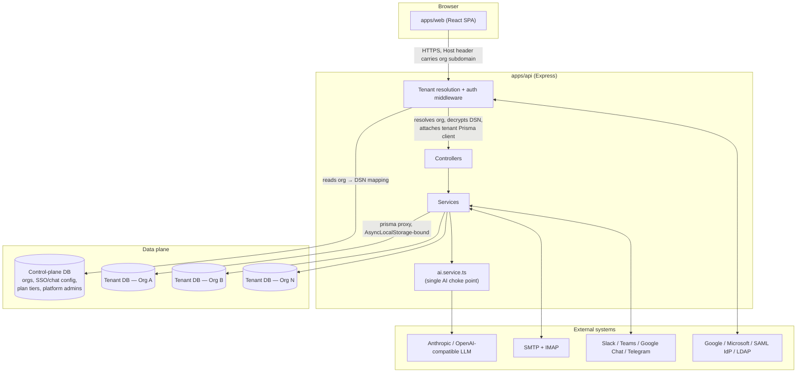
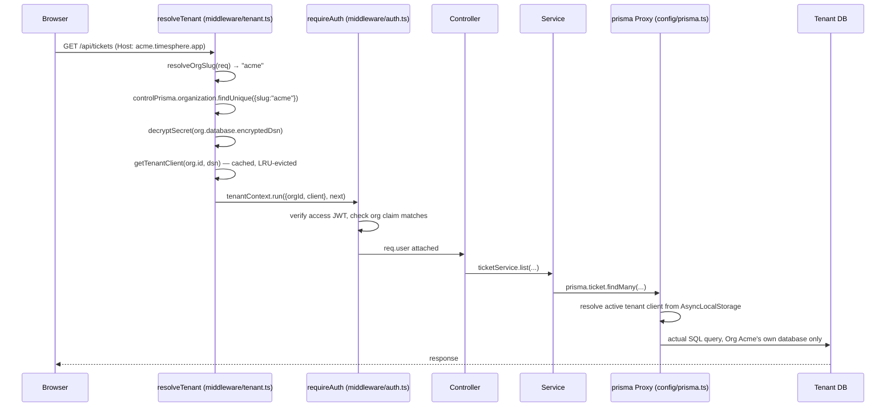
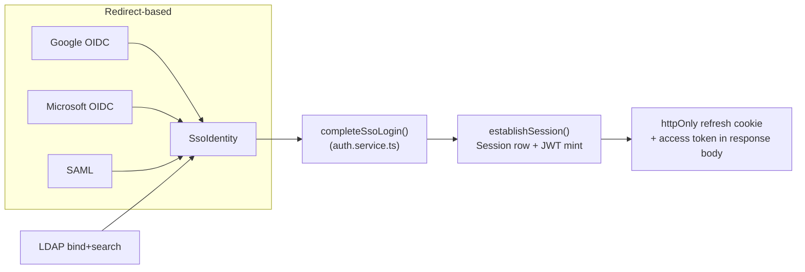
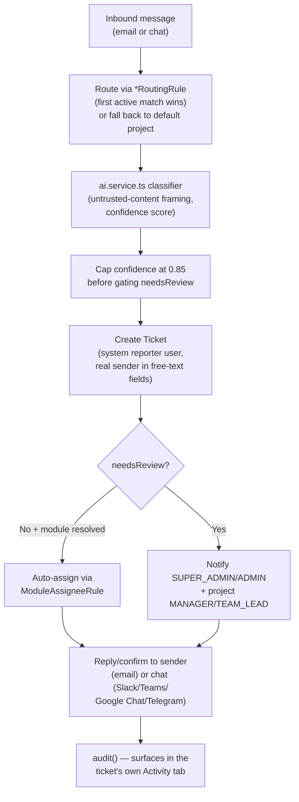
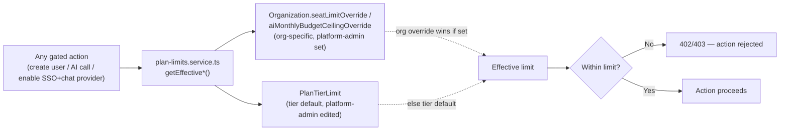
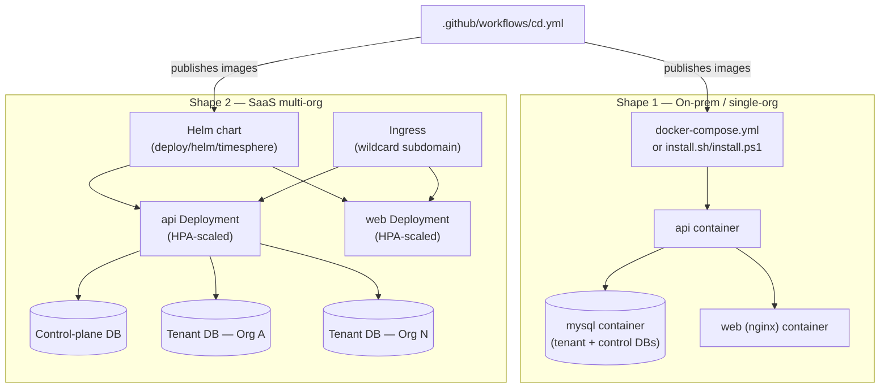

# TimeSphere — Architecture Reference

> **What this file is.** A structured, continuously-maintained map of the codebase: what each
> module is for, why it exists, what it depends on, and how data flows through the system. It is
> written for two audiences at once — a human engineer onboarding onto the project, and an AI
> coding assistant (Claude Code, Cursor, Copilot, etc.) that needs to understand the system
> before changing it. Prefer this document over re-deriving architecture from scratch by reading
> every file.
>
> **How to keep this current (read this before you skip it).** Whenever you add a new
> service/controller/worker, change what a module depends on, or add a new data flow, update the
> relevant section below in the same change. Treat an out-of-date `ARCHITECTURE.md` as a bug.
> Each module entry is deliberately terse (purpose, depends-on, depended-on-by, one "why") —
> that's the format to match when adding a new one, not prose paragraphs.

---

## 1. What this system is

TimeSphere is a **multi-tenant SaaS platform** combining timesheet management, a Jira-like
ticketing system, a bring-your-own-key AI layer, and multi-channel ticket intake (email + four
chat platforms), deployable either as a single-company on-prem install or as a true multi-org
SaaS product on the same codebase.

**The one idea everything else follows from**: every tenant (`Organization`) gets its own
**physically separate MySQL database** — never a shared table filtered by a `tenantId` column.
A small **control-plane database** (`apps/api/prisma/control/schema.prisma`) is the only place
that knows every org exists and where its database lives; it never holds ticket/timesheet
content. This is why the same 30+ controllers/services that were written assuming "the whole
database is my company" needed almost no changes to become multi-tenant — see §3.

---

## 2. Monorepo layout

| Path | Purpose |
|---|---|
| `apps/api` | Express + TypeScript API. Two Prisma schemas: `prisma/schema.prisma` (tenant data) and `prisma/control/schema.prisma` (control plane). |
| `apps/web` | React + TypeScript SPA (Vite). Talks to `apps/api` over `/api/*`. |
| `packages/shared` | Types and constants imported by both `apps/api` and `apps/web` (e.g. `GlobalAISettings`, `ChatPlatform`, permission keys) — the one place a cross-cutting type is defined once instead of drifting between frontend/backend copies. |
| `deploy/helm/timesphere` | Kubernetes Helm chart (see §8). |
| `.github/workflows` | CI (`ci.yml`) and CD (`cd.yml`) — see §8. |
| `docs/` | This file, `DEPLOYMENT.md` (operational how-to), and diagrams. |
| `install.sh` / `install.ps1` | One-click Docker Compose installers (Shape 1 — see §8). |
| `tests/e2e` | Playwright end-to-end suite. |

---

## 3. Core architectural concepts

### 3.1 Database-per-tenant multi-tenancy

- **Control plane** (`apps/api/prisma/control/schema.prisma`): `Organization`, `OrgDatabase`
  (encrypted DSN), `OrgSsoConfig`, `OrgAuthMethod`, `PlatformAdminUser`/`PlatformAdminSession`,
  `PlanTierLimit`. Nothing here is tenant *content* — only metadata about tenants.
- **Tenant resolution** (`apps/api/src/middleware/tenant.ts`): resolves which org a request
  belongs to from the `Host` header's subdomain (falls back to `DEFAULT_ORG_SLUG` when there's no
  real subdomain — the on-prem shape), decrypts that org's DSN, and wraps the rest of the request
  in an `AsyncLocalStorage` context (`apps/api/src/config/tenant-context.ts`) carrying the active
  tenant's Prisma client.
- **The `prisma` Proxy** (`apps/api/src/config/prisma.ts`): every one of the ~30 existing
  `import { prisma } from "../config/prisma.js"` call sites across controllers/services/workers
  is untouched — `prisma` is a `Proxy` that forwards every property access to whichever tenant
  client is active in the current async context. This is *why* the multi-tenancy conversion
  didn't require touching every file that already used `prisma`.
- **Cron workers have no request to hang tenant resolution off of**, so
  `apps/api/src/workers/run-for-every-org.ts` loops over every `ACTIVE` org from the control
  plane and re-runs the worker's existing body once per org, each inside that org's own tenant
  context — one org's failure is caught and logged, never blocking the rest.

### 3.2 Authentication — 4 SSO methods + password

| Provider | Mechanism | Key file |
|---|---|---|
| Password | bcrypt hash + JWT access/refresh, httpOnly cookie rotation | `services/auth.service.ts` |
| Google / Microsoft | OIDC redirect, PKCE, org identity travels in a signed `state` JWT (not the callback URL, which is one fixed URL shared by every org) | `services/sso.service.ts` |
| SAML | IdP-initiated POST binding to a per-app-fixed ACS URL, org identity in `RelayState` | `services/sso.service.ts` |
| LDAP / Active Directory | Direct bind (no redirect) — service-account bind + search, then rebind as the found DN to verify the password | `services/sso.service.ts` (LDAP section) |

All four converge on the same tail: `completeSsoLogin`/`login` → `establishSession` (session row +
JWT mint) in `services/auth.service.ts`. Every access/refresh token carries an `org` claim
cross-checked against the tenant the request resolved to — defense-in-depth, not the primary
isolation boundary (the separate physical databases are).

### 3.3 The AI layer — one choke point

`apps/api/src/services/ai.service.ts` is the **only** place that knows how to call an LLM.
Every capability (`classifyTicket`, `classifyChatMessage`, `findDuplicateTickets`, writing
assistant, comment summary, workspace search, weekly digest) goes through `preflight(feature)` →
`callChat(settings, params)`. `preflight` enforces: the workspace-wide `aiEnabled` switch, the
specific feature's own toggle, and the **effective AI budget** (`min(org's own budget, plan-tier
ceiling)`, re-read on every call so a platform admin lowering a tier's ceiling takes effect
immediately, not after some reconciliation job). `callChat` branches on `GlobalAISettings.provider`
(`ANTHROPIC` native API, or `OPENAI_COMPATIBLE` via the `openai` SDK for every other vendor) —
no capability function knows or cares which is active.

### 3.4 External-content intake pipelines (email + chat)

Both `services/email-intake.service.ts` and `services/chat-intake.service.ts` follow the same
shape: **route → classify → create → confidence-gate → reply/confirm → audit**. A routing rule
(`EmailRoutingRule` / `ChatRoutingRule`) decides which project a message belongs to; the AI
classifier's confidence is capped at `EXTERNAL_INTAKE_CONFIDENCE_CEILING` (0.85, in
`ai.service.ts`) before it's allowed to suppress human review — a single self-reported number
from unauthenticated external content should never be able to fully bypass review, even before
considering prompt injection. Both pipelines create the ticket under a dedicated system "reporter"
user (`EMAIL_INTAKE_SYSTEM_EMAIL` / `CHAT_INTAKE_SYSTEM_EMAIL`) since `Ticket.reporterId` needs a
real `User` row, while the real sender lives in separate free-text fields
(`externalReporterEmail`/`externalChatUserId` etc.).

### 3.5 Plan-tier enforcement

`services/plan-limits.service.ts` re-reads (never caches) an org's effective seat limit, AI
budget ceiling, allowed SSO providers, and allowed chat platforms on every relevant check —
seat creation, AI calls, and the "enable this provider/platform" toggle in Workspace Settings.
Enforced live, not just validated once at signup, so a platform admin's change takes effect on
the very next request.

### 3.6 Platform-admin console

A structurally separate admin surface (`/platform-admin`, own JWT secret
`PLATFORM_ADMIN_JWT_SECRET`, own `PlatformAdminUser` table that doesn't exist in any tenant
database — a compromised tenant DB can never yield platform credentials). Manages org lifecycle,
plan-tier limits, and cross-org analytics. `services/platform-admin-analytics.service.ts` is the
**sole file in the codebase allowed to loop over every tenant database**, and is restricted by
convention to aggregate/count queries — never row-level ticket/comment content. That convention
is the concrete, auditable point where the "no cross-tenant data leakage" guarantee either holds
or doesn't.

---

## 4. Request lifecycle (a normal, tenant-resolved API call)

## 5. SSO / webhook routes that bypass normal tenant resolution

A handful of routes are mounted **before** `app.use("/api", resolveTenant)` in `apps/api/src/app.ts`
because they can't rely on subdomain resolution:

| Route prefix | Why it's special | Handled in |
|---|---|---|
| `/api/auth/sso/*` (OIDC start/callback, SAML ACS) | The provider redirects to one fixed callback URL — never that org's own subdomain. Org identity travels in a signed `state`/`RelayState` JWT instead. | `controllers/sso.controller.ts` |
| `/api/platform-admin/*` | Cross-tenant by nature (org CRUD, analytics) — has its own auth entirely. | `controllers/platform-admin.controller.ts` |
| `/api/chat/*/events/:orgSlug`, `/api/chat/teams/messages/:orgSlug` | An external chat platform calling a fixed webhook URL has no Host-header subdomain to resolve from — org is identified directly from the URL path instead, with authenticity proven per-platform (Slack HMAC signature / Teams Bot Framework JWT / Google Chat shared token), not by the URL's secrecy. **Must be mounted before the global `express.json()` body parser** — Slack's signature check needs the exact raw request bytes, and body parsers only read the request stream once. | `controllers/chat-webhook.controller.ts` |

`/api/auth/login/ldap` is the one exception that does **not** need special mounting — LDAP is a
direct POST with a body, resolved via the normal Host-header tenant middleware exactly like
password login (`controllers/auth.controller.ts`).

---

## 6. Module reference (the "graph")

Format per entry: **purpose** — one line. **Depends on** — what it calls/imports that matters
architecturally. **Depended on by** — who calls it. Skip trivial/obvious dependencies (e.g. every
service depends on `config/prisma.ts`; not repeated below unless it's the point of the entry).

### Control plane & multi-tenancy

| File | Purpose | Depends on | Depended on by |
|---|---|---|---|
| `config/control-prisma.ts` | The control-plane's own `PrismaClient` singleton — deliberately separate from the tenant `prisma` proxy. | — | Everything that touches org/SSO/plan-tier metadata |
| `config/tenant-context.ts` | `AsyncLocalStorage` holding `{orgId, orgSlug, client}` for the current request/worker tick. | — | `config/prisma.ts`, `middleware/tenant.ts`, `workers/run-for-every-org.ts` |
| `config/prisma.ts` | The `prisma` Proxy + `getTenantClient(orgId, dsn)` factory (LRU-capped, per-tenant connection-limited). | `tenant-context.ts` | Every controller/service (unchanged import) |
| `middleware/tenant.ts` | Resolves org from Host header, attaches tenant context. Exports `resolveOrgSlug`/`resolveActiveOrgBySlug` reused by SSO/chat-webhook routes that can't use the middleware directly. | `control-prisma.ts`, `config/prisma.ts`, `utils/encryption.ts` | `app.ts` (global), `sso.controller.ts`, `chat-webhook.controller.ts` |
| `workers/run-for-every-org.ts` | Cron-worker equivalent of tenant resolution — loops every `ACTIVE` org, runs a callback per-org inside its tenant context. | `control-prisma.ts`, `config/prisma.ts` | Every `workers/*.ts` cron file |
| `services/provisioning.service.ts` | Full org provisioning flow: create physical DB → migrate → seed → register `OrgDatabase`. Every step idempotent/retry-safe. | `prisma/seed.ts#seedTenant`, `scripts` (invokes Prisma CLI directly via `node`, not `npx.cmd`, to avoid a Windows spawn restriction — see its own comment) | `controllers/platform-admin.controller.ts`, `scripts/migrate-all-tenants.ts` |
| `scripts/migrate-all-tenants.ts` | Fans a new migration out across every tenant DB, skipping already-current ones, isolating one org's failure from the rest. | `provisioning.service.ts` | Run manually after merging a migration (`npm run migrate:tenants`) |
| `services/plan-limits.service.ts` | Effective (org-override-or-tier-default) seat limit / AI budget / allowed SSO providers / allowed chat platforms — always re-read, never cached. | `control-prisma.ts` | `ai.service.ts`, `user.controller.ts`, `auth.service.ts`, `settings.controller.ts`, `chat-integrations.controller.ts` |
| `services/platform-admin-analytics.service.ts` | **The sole cross-tenant-loop file** — aggregate-only reporting for `/platform-admin`. | `run-for-every-org.ts`-style loop | `controllers/platform-admin.controller.ts` |
| `services/platform-admin-auth.service.ts` + `utils/platform-admin-security.ts` + `middleware/platform-admin-auth.ts` | Entirely separate auth stack from tenant auth — own JWT secret, own session table, own cookie path. | `control-prisma.ts` | `controllers/platform-admin.controller.ts` |

### Auth & SSO

| File | Purpose | Depends on | Depended on by |
|---|---|---|---|
| `services/auth.service.ts` | Password login, `completeSsoLogin` (shared find-or-create tail for every SSO provider), `establishSession`, refresh-token rotation with reuse detection. | `utils/security.ts`, `plan-limits.service.ts` | `controllers/auth.controller.ts`, `controllers/sso.controller.ts` |
| `services/sso.service.ts` | Google/Microsoft OIDC, SAML, and LDAP — builds authorization redirects / completes the exchange / does the LDAP bind, normalizes all four into one `SsoIdentity` shape. | `openid-client`, `@node-saml/node-saml`, `ldapts`, `utils/encryption.ts` | `controllers/sso.controller.ts`, `controllers/auth.controller.ts` (LDAP only) |
| `controllers/sso.controller.ts` | OIDC/SAML HTTP routes, mounted pre-tenant-resolution. SAML routes registered **before** the generic `/:provider/*` routes — Express matching order, see file header. | `sso.service.ts`, `auth.service.ts` | `app.ts` |
| `controllers/auth.controller.ts` | Password login, LDAP login, session management, profile. | `auth.service.ts`, `sso.service.ts` (LDAP only) | `app.ts` |

### AI & content-intake pipelines

| File | Purpose | Depends on | Depended on by |
|---|---|---|---|
| `services/ai.service.ts` | The one AI choke point — see §3.3. | `@anthropic-ai/sdk`, `openai`, `plan-limits.service.ts` | `email-intake.service.ts`, `chat-intake.service.ts`, `ticket.controller.ts`, `ai.controller.ts` |
| `services/email-intake.service.ts` | Email → ticket pipeline (see §3.4). | `ai.service.ts`, `ticket.service.ts`, `notify.service.ts` | `workers/inbound-email.worker.ts`, `controllers/email-intake.controller.ts` |
| `services/chat-intake.service.ts` | Chat → ticket pipeline, same shape as email intake (see §3.4). | `ai.service.ts`, `chat-outbound.service.ts`, `ticket.service.ts`, `notify.service.ts` | `controllers/chat-webhook.controller.ts`, `workers/chat-telegram.worker.ts` |
| `services/chat-outbound.service.ts` | Sends the "ticket created" reply back into Slack/Teams/Google Chat/Telegram — one function per platform, same "single entry point, branch per provider" shape as `ai.service.ts#callChat`. | `utils/encryption.ts` | `chat-intake.service.ts` |
| `controllers/chat-webhook.controller.ts` | Inbound webhook receivers for Slack/Teams/Google Chat (push-only APIs) — see §5 for why this is mounted specially. | `middleware/tenant.ts` helpers, `chat-intake.service.ts` | `app.ts` |
| `workers/chat-telegram.worker.ts` | Telegram long-polling (the one chat platform that supports polling, avoiding a public endpoint requirement). | `run-for-every-org.ts`, `chat-intake.service.ts` | `server.ts` |
| `controllers/chat-integrations.controller.ts` | Org-admin settings CRUD for chat platform credentials + routing rules, plan-tier gated. | `plan-limits.service.ts` | `app.ts` |
| `workers/inbound-email.worker.ts` | IMAP polling (chosen over a webhook so this app needs no public domain by default). | `run-for-every-org.ts`, `email-intake.service.ts` | `server.ts` |

### DevOps / deployment

| File | Purpose |
|---|---|
| `.github/workflows/ci.yml` | Typecheck/build/full-e2e on Linux (real MySQL service container); typecheck/build-only cross-platform job on Windows; installer-script syntax checks. |
| `.github/workflows/cd.yml` | Builds + pushes `apps/api`/`apps/web` images to GHCR on push to `main`/version tags. |
| `install.sh` / `install.ps1` | One-click Docker Compose bring-up for Shape 1 (on-prem/single-org) — generate `.env` with strong secrets, `docker compose up -d --build`, wait for health, run the one-time seed. |
| `deploy/helm/timesphere/` | Kubernetes chart for both shapes — `mysql.enabled` toggles self-hosted vs. external managed DB, `ingress.wildcardHost` enables SaaS subdomain routing, `api.autoscaling`/`web.autoscaling` drive real `HorizontalPodAutoscaler`s (the one place genuine autoscaling exists in this project — Compose has no orchestrator to react to load with). |

---

## 7. Key data-flow diagrams

### 7.1 SSO login (all four providers converge on one session tail)

### 7.2 Chat/email intake → ticket

### 7.3 Plan-tier enforcement (live, not cached)

### 7.4 Deployment shapes

---

## 8. Glossary

| Term | Meaning |
|---|---|
| **Org / Organization** | One customer/company. Row in the control-plane `Organization` table. |
| **Tenant** | The physical database + all content belonging to one Org. |
| **DEFAULT_ORG_SLUG** | The org a request with no real subdomain resolves to — what makes on-prem a special case of the SaaS shape, not a separate code path. |
| **Plan tier** | `STARTER` / `TEAM` / `ENTERPRISE` — default seat/AI-budget/SSO/chat-platform limits, overridable per org. |
| **System reporter user** | `email-intake@system.local` / `chat-intake@system.local` — seeded accounts satisfying `Ticket.reporterId`'s FK for externally-sourced tickets; nobody logs in as them. |
| **`needsReview`** | Set when a ticket's (capped) AI confidence falls below the org's configured threshold — surfaces to reviewers instead of silent auto-assignment. |
| **`EXTERNAL_INTAKE_CONFIDENCE_CEILING`** | 0.85 — the cap on how much a single self-reported AI confidence value (from untrusted external content) can suppress `needsReview`, defined once in `ai.service.ts` and shared by both intake pipelines. |

---

*Last updated during: Track D (LDAP SSO), Track E (Slack/Teams/Google Chat/Telegram connectors), Track F (CI/CD, one-click installers, Kubernetes Helm chart with autoscaling).*
