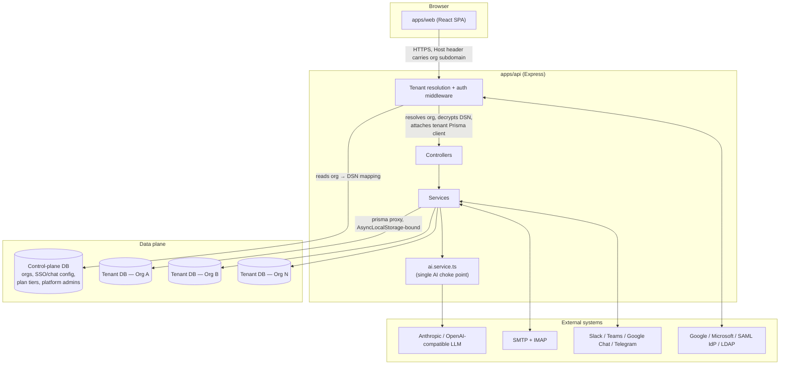
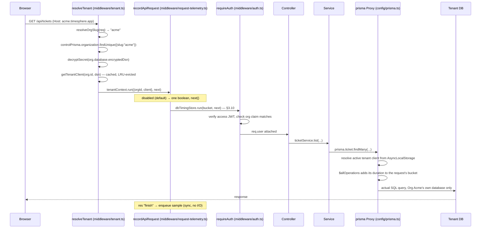
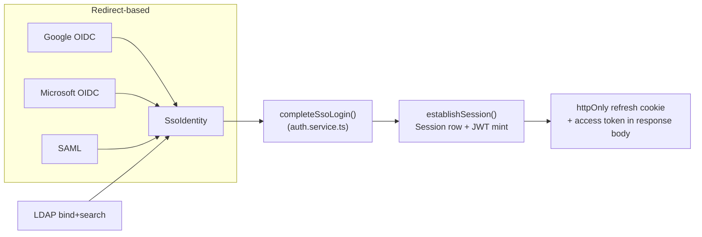
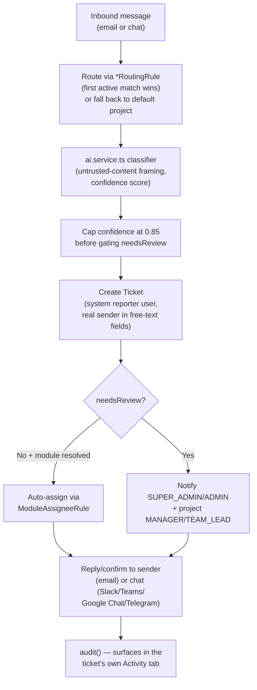
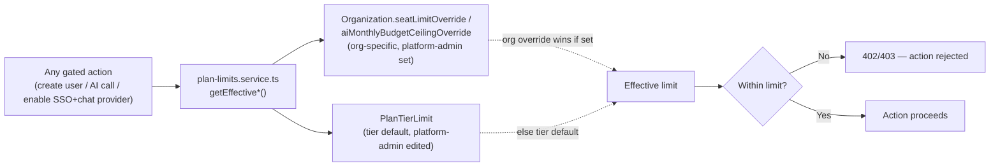
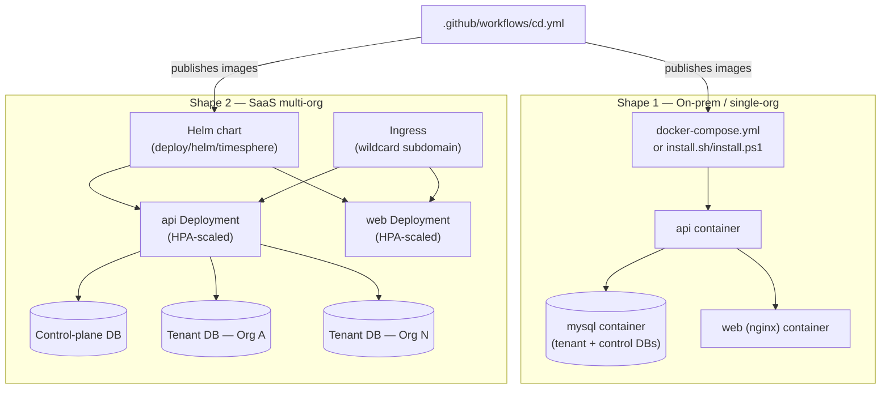

# TimeSphere — Architecture Reference

> **What this file is.** A structured, continuously-maintained map of the codebase: what each
> module is for, why it exists, what it depends on, and how data flows through the system. It is
> written for two audiences at once — a human engineer onboarding onto the project, and an AI
> coding assistant (Claude Code, Cursor, Copilot, etc.) that needs to understand the system
> before changing it. Prefer this document over re-deriving architecture from scratch by reading
> every file.
>
> **How to keep this current (read this before you skip it).** Whenever you add a new
> service/controller/worker, change what a module depends on, or add a new data flow, update the
> relevant section below in the same change. Treat an out-of-date `ARCHITECTURE.md` as a bug.
> Each module entry is deliberately terse (purpose, depends-on, depended-on-by, one "why") —
> that's the format to match when adding a new one, not prose paragraphs.

---

## 1. What this system is

TimeSphere is a **multi-tenant SaaS platform** combining timesheet management, a Jira-like
ticketing system, a bring-your-own-key AI layer, and multi-channel ticket intake (email + four
chat platforms), deployable either as a single-company on-prem install or as a true multi-org
SaaS product on the same codebase.

**The one idea everything else follows from**: every tenant (`Organization`) gets its own
**physically separate MySQL database** — never a shared table filtered by a `tenantId` column.
A small **control-plane database** (`apps/api/prisma/control/schema.prisma`) is the only place
that knows every org exists and where its database lives; it never holds ticket/timesheet
content. This is why the same 30+ controllers/services that were written assuming "the whole
database is my company" needed almost no changes to become multi-tenant — see §3.

---

## 2. Monorepo layout

| Path | Purpose |
|---|---|
| `apps/api` | Express + TypeScript API. Two Prisma schemas: `prisma/schema.prisma` (tenant data) and `prisma/control/schema.prisma` (control plane). |
| `apps/web` | React + TypeScript SPA (Vite). Talks to `apps/api` over `/api/*`. |
| `packages/shared` | Types and constants imported by both `apps/api` and `apps/web` (e.g. `GlobalAISettings`, `ChatPlatform`, permission keys) — the one place a cross-cutting type is defined once instead of drifting between frontend/backend copies. |
| `deploy/helm/timesphere` | Kubernetes Helm chart (see §8). |
| `.github/workflows` | CI (`ci.yml`) and CD (`cd.yml`) — see §8. |
| `docs/` | This file, `DEPLOYMENT.md` (operational how-to), and diagrams. |
| `install.sh` / `install.ps1` | One-click Docker Compose installers (Shape 1 — see §8). |
| `tests/e2e` | Playwright end-to-end suite (repo root — exercises both `apps/api` and `apps/web` together). |
| `apps/api/tests` | Vitest unit (`tests/unit`, mocked, no real DB) + integration (`tests/integration`, real throwaway MySQL) tests, scoped to `apps/api` alone — AI service, Stripe billing, SCIM, face verification. |
| `tsconfig.base.json` | The compiler options every workspace extends — `strict`, and `noUnusedLocals` so dead imports and locals are build errors rather than silent accumulation. |
| `eslint.config.mjs` | The SonarJS rule set (`eslint-plugin-sonarjs` is the analyzer SonarQube runs for JS/TS) plus the React Rules of Hooks, so the same findings a Sonar dashboard would report are reproducible offline and in CI without a server URL or token. Run by `npm run lint` after the typechecks; **errors gate at zero, warnings are tracked debt** — the rationale, and which rules are deliberately demoted, are written in the config itself and in `sonar-project.properties`. |

---

## 3. Core architectural concepts

### 3.1 Database-per-tenant multi-tenancy

- **Control plane** (`apps/api/prisma/control/schema.prisma`): `Organization`, `OrgDatabase`
  (encrypted DSN), `OrgSsoConfig`, `OrgAuthMethod`, `PlatformAdminUser`/`PlatformAdminSession`,
  `PlanTierLimit`. Nothing here is tenant *content* — only metadata about tenants.
- **Tenant resolution** (`apps/api/src/middleware/tenant.ts`): resolves which org a request
  belongs to from the `Host` header's subdomain (falls back to `DEFAULT_ORG_SLUG` when there's no
  real subdomain — the on-prem shape), decrypts that org's DSN, and wraps the rest of the request
  in an `AsyncLocalStorage` context (`apps/api/src/config/tenant-context.ts`) carrying the active
  tenant's Prisma client.
- **The `prisma` Proxy** (`apps/api/src/config/prisma.ts`): every one of the ~30 existing
  `import { prisma } from "../config/prisma.js"` call sites across controllers/services/workers
  is untouched — `prisma` is a `Proxy` that forwards every property access to whichever tenant
  client is active in the current async context. This is *why* the multi-tenancy conversion
  didn't require touching every file that already used `prisma`.
- **Cron workers have no request to hang tenant resolution off of**, so
  `apps/api/src/workers/run-for-every-org.ts` loops over every `ACTIVE` org from the control
  plane and re-runs the worker's existing body once per org, each inside that org's own tenant
  context — one org's failure is caught and logged, never blocking the rest.

### 3.2 Authentication — 4 SSO methods + password

| Provider | Mechanism | Key file |
|---|---|---|
| Password | bcrypt hash + JWT access/refresh, httpOnly cookie rotation | `services/auth.service.ts` |
| Google / Microsoft | OIDC redirect, PKCE, org identity travels in a signed `state` JWT (not the callback URL, which is one fixed URL shared by every org) | `services/sso.service.ts` |
| SAML | IdP-initiated POST binding to a per-app-fixed ACS URL, org identity in `RelayState` | `services/sso.service.ts` |
| LDAP / Active Directory | Direct bind (no redirect) — service-account bind + search, then rebind as the found DN to verify the password | `services/sso.service.ts` (LDAP section) |

All four converge on the same tail: `completeSsoLogin`/`login` → `establishSession` (session row +
JWT mint) in `services/auth.service.ts`. Every access/refresh token carries an `org` claim
cross-checked against the tenant the request resolved to — defense-in-depth, not the primary
isolation boundary (the separate physical databases are).

### 3.3 The AI layer — one choke point

`apps/api/src/services/ai.service.ts` is the **only** place that knows how to call an LLM.
Every capability goes through `preflight(feature)` → `callChat(settings, params)` — around thirty of
them now, so the authoritative list is `ai-capability.registry.ts` rather than a sentence here that
goes stale every release. The families: ticket and chat classification, duplicate detection, the
writing assistant, comment summaries, weekly digests, the two face assessments, project risk
narration, agent steps, the four change-management capabilities (§3.13), and the Ask AI answer loop
(§3.14). `preflight` enforces: the workspace-wide `aiEnabled` switch, the
specific feature's own toggle, and the **effective AI budget** (`min(org's own budget, plan-tier
ceiling)`, re-read on every call so a platform admin lowering a tier's ceiling takes effect
immediately, not after some reconciliation job). `callChat` branches on `GlobalAISettings.provider`
(`ANTHROPIC` native API, or `OPENAI_COMPATIBLE` via the `openai` SDK for every other vendor) —
no capability function knows or cares which is active.

### 3.4 External-content intake pipelines (email + chat)

Both `services/email-intake.service.ts` and `services/chat-intake.service.ts` follow the same
shape: **route → classify → create → confidence-gate → reply/confirm → audit**. A routing rule
(`EmailRoutingRule` / `ChatRoutingRule`) decides which project a message belongs to; the AI
classifier's confidence is capped at `EXTERNAL_INTAKE_CONFIDENCE_CEILING` (0.85, in
`ai.service.ts`) before it's allowed to suppress human review — a single self-reported number
from unauthenticated external content should never be able to fully bypass review, even before
considering prompt injection. Both pipelines create the ticket under a dedicated system "reporter"
user (`EMAIL_INTAKE_SYSTEM_EMAIL` / `CHAT_INTAKE_SYSTEM_EMAIL`) since `Ticket.reporterId` needs a
real `User` row, while the real sender lives in separate free-text fields
(`externalReporterEmail`/`externalChatUserId` etc.).

### 3.5 Plan-tier enforcement

`services/plan-limits.service.ts` re-reads (never caches) an org's effective seat limit, AI
budget ceiling, allowed SSO providers, and allowed chat platforms on every relevant check —
seat creation, AI calls, and the "enable this provider/platform" toggle in Workspace Settings.
Enforced live, not just validated once at signup, so a platform admin's change takes effect on
the very next request.

### 3.6 Platform-admin console

A structurally separate admin surface (`/platform-admin`, own JWT secret
`PLATFORM_ADMIN_JWT_SECRET`, own `PlatformAdminUser` table that doesn't exist in any tenant
database — a compromised tenant DB can never yield platform credentials). Manages org lifecycle,
plan-tier limits, and cross-org analytics. `services/platform-admin-analytics.service.ts` is the
**sole file in the codebase allowed to loop over every tenant database**, and is restricted by
convention to aggregate/count queries — never row-level ticket/comment content. That convention
is the concrete, auditable point where the "no cross-tenant data leakage" guarantee either holds
or doesn't.

### 3.7 Face (identity) verification — server-authoritative by construction

Optional, off by default, Enterprise-tier gated. Confirms the person submitting a
timesheet/ticket — or moving a ticket through its workflow, or **approving** a timesheet — is
the account holder. Four design constraints drive the whole shape of it:

1. **Every decision is made server-side.** The browser only uploads JPEGs — there is no
   face-matching code in the web bundle at all. This is not a performance choice: a client that
   decides its own verification outcome is not a security control, because any employee could
   POST a "passed" result from devtools. `services/face.service.ts` owns detection, anti-spoof,
   liveness, pose measurement, and comparison.
2. **Anti-spoof is checked BEFORE the match.** Otherwise holding a printed photo of the right
   colleague up to the webcam passes on similarity alone — the exact attack the feature exists
   to stop.
3. **A passed check is a single-use, short-lived token.** `POST /api/face/verify` returns a
   `verificationId` that `consumeVerification()` redeems at submit time — same user, same
   context, not already spent, not expired. A conditional `updateMany` arbitrates concurrent
   double-submits, so exactly one wins. Gates on CREATE routes consume *before* the row exists
   and bind the attempt to it afterwards (`bindVerificationToRecord`) — that binding is what
   the "Identity verified" badges join on.
4. **Anti-injection is challenge–response, not frame forensics.** A virtual camera replaying a
   recorded video defeats per-frame anti-spoof honestly (each frame IS a live-looking face). So
   the server issues a random head-movement instruction (single-use, 90s) and measures the
   actual pose delta between a neutral and a gesture frame — a movement chosen *after* the
   recording existed is the one thing a replay cannot perform. Device-label and
   network-novelty heuristics are recorded as review *signals*, never verdicts (both are
   client-influenced and spoofable; a suspected virtual camera flags the attempt for human
   review even when it passes).

**The plan entitlement splits its failure directions deliberately**
(`plan-limits.service.ts#isFaceVerificationAllowed`): configuration/enrollment/verification
fail **closed** (403 — no new biometric collection without the entitlement), while enforcement
on submissions fails **open** (`isFaceVerificationRequired` returns false) — a lapsed payment
must stop *demanding* checks, not lock a workforce out of logging time. Downgrade data handling
(30-day grace, then purge) lives in the retention worker.

Biometric data is treated as its own category throughout: templates are AES-256-GCM encrypted
(same helper as API keys), and captured images live **outside** the public `/uploads` static
mount — that mount has no authentication at all, so anything under it is world-readable to
anyone who guesses a filename. Face imagery is served only by `GET /api/face/image/...`, which
checks session, tenant, and subject-or-admin, and is stored org-scoped
(`face/<orgId>/<userId>/`) so an org's imagery can be purged as a directory.
`workers/face-retention.worker.ts` runs the whole daily lifecycle — image retention, downgrade
grace/purge, enrollment reminders, overdue-review nudges, challenge cleanup — because a policy
nothing enforces is just a document; `workers/identity-weekly-digest.worker.ts` sends admins
the deterministic Monday recap (no AI writes emails about named employees' identity checks).

See [FACE_VERIFICATION.md](FACE_VERIFICATION.md) for calibration, thresholds, the threat-model
table, and the regulatory obligations (GDPR Art.9, Illinois BIPA, India DPDP) it carries.

### 3.8 Maintenance mode — one gate, fails open, super admin exempt

A SUPER_ADMIN schedules a window (start/end/message) from Workspace Settings → Maintenance;
while the window is **active**, every non-SUPER_ADMIN is locked out. Four decisions define the
design (`services/maintenance.service.ts`):

1. **One enforcement choke point, two doors.** The active-check runs inside `requireAuth`
   (covers every authenticated route — nothing to remember to mount) and inside
   `establishSession` (covers every login method: password, Google, Microsoft, SAML, LDAP —
   they all terminate there, so none can become the forgotten side door). Rejection is
   **503 + `code: "MAINTENANCE"`**, never 401: the client must distinguish "your session is
   bad" (refresh, re-login) from "the workspace is closed" (show `/maintenance`, stop retrying).
2. **The check is cached (10s per tenant) and FAILS OPEN.** It sits on the hottest path in the
   app; uncached it would add a query to every call for a value that changes a handful of times
   a year. And a broken settings lookup must degrade to "app works normally" — never to
   "everyone is locked out by an exception". The settings PATCH invalidates the cache so a
   toggle is enforced immediately, not after the TTL.
3. **"Online" means `Session.lastSeenAt` within 15 minutes** — stamped by a throttled
   (5-min, in-memory, fire-and-forget) write in `requireAuth`, not `expiresAt`, which would
   count everyone who logged in this month. The admin panel shows people, not sessions
   (multi-tab dedup). Force-logout is server-side revocation of every non-SUPER_ADMIN session:
   next request 401s → refresh fails → login is refused (maintenance) → `/maintenance` page.
   The chain needs zero client cooperation, which is what makes it a control.
4. **`GET /api/maintenance/status` is public** (tenant-resolved, rate-limited 30/min): the
   people who most need it are exactly those whose tokens were just revoked. It exposes only
   what the lockout page renders — phase, window, message — and only while the mode is enabled.

The SUPER_ADMIN exemption is deliberate and minimal: someone has to do the maintenance, verify
the result, and switch it off. The "warn users" action (in-app + email to online non-admins) is
gated by its own notification toggle (`emailMaintenanceScheduled`) like every other category.

Two neighbors ride on the same machinery:

- **Server health** (`services/system-health.service.ts`, `GET /api/maintenance/health`):
  live CPU/memory/disk/latency + a component checklist, measured on the instance that answered
  (the payload names host+pid rather than posing as a cluster aggregate) and guaranteed never
  to throw — a dead dependency reports `ok: false`, because a health check that 500s when
  things are unhealthy defeats itself.
- **Per-user login visibility** (Users page): the same `lastSeenAt` window powers a live online
  dot per user; `User.firstLoginAt` is stamped exactly once in `establishSession` (never
  backfilled — null honestly means "unknown"); and `POST /users/:id/force-logout` is the
  bulk force-logout scoped to one person, with the extra guard that only a SUPER_ADMIN may
  sign out a SUPER_ADMIN.

### 3.9 The planning layer (V6) — additive by construction

TimeSphere tracks *the work* and *the time spent on it*, but had no way to express *the plan*:
no hierarchy above a flat ticket, no dates other than the SLA-derived `dueAt`, no capacity, no
intake forms, no approvals on deliverables, no fields or statuses a customer could name
themselves. V6 adds that layer. The governing constraint is that **an org which upgrades and
touches nothing must behave exactly as it did before** — so every table is new, every column
added to an existing table is nullable or defaulted, and every capability is inert until an
admin opts in on `GlobalPlanningSettings` (all six toggles default false, matching `aiEnabled`,
`enableAttestations` and the face-verification switch).

**The work item is `Ticket`, not a new table.** Hierarchy (`parentId`), schedule (`startDate`/
`endDate`), effort (the existing `estimatedHours`), progress and baselines are columns on
`Ticket`. Everything a planned work item needs — comments, attachments, watchers, labels, links,
checklists, logged hours via `Timesheet.ticketId`, SLA, AI triage — already hangs off `Ticket`. A
parallel `Task` table would have had to duplicate all of it and force every report to `UNION`,
and would have made users decide "is this a ticket or a task?" on every capture.

**`WorkflowStatus.legacyStatus` is the compatibility hinge, and it is the one piece of V6 worth
understanding before changing anything.** Admin-defined statuses live in `Workflow` /
`WorkflowStatus` / `WorkflowTransition`, and each status declares which built-in `TicketStatus`
it writes to `Ticket.status`. Both columns are written in the same update by
`services/workflow.service.ts#resolveStatusWrite`. The consequence: the ~40 existing readers of
`Ticket.status` — the SLA sweep, the escalation worker, every report aggregate, the CSV/PDF
exports, the public API, webhook payloads, the Kanban's columns, `ticketStatusTransitions`
itself — keep working untouched *and keep being correct*, without any of them learning that
custom statuses exist. Replacing the enum with a foreign key was the obvious alternative and was
rejected: it would have meant auditing and rewriting every one of those call sites, on a live
multi-tenant product, for no user-visible gain. `WorkStatusCategory` (TODO/ACTIVE/REVIEW/DONE/
CANCELLED) is the richer vocabulary the *new* surfaces read, and is what makes CANCELLED
expressible at all — the built-in enum has no such value, so a cancelled item maps to
`legacyStatus = CLOSED` for old code while new code can still tell it from a successful close.

The phase-1 migration seeds a **system "Default" workflow** whose six statuses and nine
transitions are `ticketStatusTransitions` expressed as rows, and backfills every existing
ticket's `workflowStatusId` from the status it is already in. A workspace that never opens the
workflow editor is therefore running the same rules it always was.

**Entitlements fail closed, with one deliberate asymmetry.** `plan-limits.service.ts` gains
`isPlanningCapabilityAllowed` / `getPlanningEntitlements` / `getPlanningQuota`, read per request
and never cached like every other limit. Unlike face verification there is **no fail-open
counterpart**: a lapsed plan must not stop someone submitting a timesheet, but planning data is
never load-bearing for day-to-day work — a downgraded org loses the Gantt *view* while every
ticket, date and booking stays in the database, readable and intact. Losing a view is a
recoverable annoyance; being unable to log time is not.

**JSON vs rows** is decided by one test throughout this layer: *does anything query across the
individual items?* Custom field **values** are rows (`CustomFieldValue`) because saved views
filter on them and dashboards group by them. Request-form schemas, dashboard widget layouts and
blueprint payloads are JSON because each is authored, versioned and rendered whole.

**The schedule is computed in exactly one place.** `services/plan-schedule.service.ts` is a pure
core (working-day arithmetic, dependency resolution, critical path, effort-weighted progress
roll-up, baseline slip) with a thin DB shell (`buildPlan`). The timeline, the portfolio roll-up
and — from Phase 5 — the risk scorer and any scheduled PDF all call it, because three surfaces
each deriving "when does this actually start" would disagree, and the one that disagrees is
always the one somebody is looking at. Its purity is also why it is the most heavily unit-tested
file in the layer: every interesting scheduler bug is arithmetic (an off-by-one on a working day
makes every Gantt bar a day too long; a lag applied to the wrong endpoint moves the wrong task),
and none of those throw — they render plausibly and are wrong.

**It computes, it never auto-schedules.** Explicit dates always win. When a human-entered date
contradicts a dependency, the solver reports a `violation` and still renders what was typed. A
scheduler that silently rewrites forty dates because one predecessor moved is one people stop
trusting the first time it is wrong, and there is no undo for it. Phase 5's AI copilots propose
date changes the same way: as a reviewable diff, never a write.

**`BLOCKS` is treated as finish-to-start.** It is the only dependency vocabulary the ticket
detail sheet has ever offered, so V5 workspaces have real data recorded under it. The four
`*_TO_*` types added in V6 sit alongside it rather than replacing it, and reinterpreting `BLOCKS`
would have silently changed existing plans.

**Resourcing is where this product beats a pure PM tool, and the reason is structural.** Wrike,
Asana and the rest hold only estimates, so they can compare a plan against another plan.
TimeSphere already has approved timesheets with a rate snapshot, so `services/workload.service.ts`
puts three things on one axis: PLANNED (a `ResourceBooking`), ACTUAL (approved `Timesheet` rows)
and CAPACITY (`User.weeklyCapacityHours`). "Ana is booked at 110%" is a forecast; "Ana is booked
at 110% and logged 46 hours" is evidence. Same pure-core/thin-shell split as the scheduler, for
the same reason — the failure modes are silent arithmetic (spreading a booking over calendar days
rather than working days inflates the whole company's load by 40%, and the board still looks
plausible).

**Bookings are never refused for overlapping.** Double-booking is sometimes deliberate, and a
system that rejects the second booking forces a planner to record something untrue to get past
it. Conflicts are surfaced, not prevented. Likewise 100% allocation is *not* flagged — a person
booked to exactly their capacity is fully booked, which is the intended state; flagging it would
light up the whole board on a well-planned sprint and train everyone to ignore the colour.

**The AI planning copilot writes through one envelope and never directly.** Every planning AI
feature emits an `AiProposal` whose `AiProposalChange` rows a human accepts or rejects
individually; `services/ai-proposal.service.ts` is the only thing that applies them. The reason is
scale: these features propose MANY changes at once (break this epic into fourteen tasks, shift
forty dates), and a yes/no dialog over a change set that size is a rubber stamp, not review —
with no undo. Per-row decisions are also a far richer quality signal than the thumbs-up/down on
`AIInteraction`, and they are produced as a by-product of people doing their normal work.

**Stale-state detection is what makes it safe rather than merely careful.** A proposal is computed
against the plan as it was, then sits in a queue. Every `UPDATE` row carries the before-state it
was computed from, and application refuses any row whose current value no longer matches —
otherwise applying would silently revert whoever moved it, and that person would never know. The
refusal is recorded on the row, so a partially-applied proposal explains itself. Rows are applied
independently rather than in one transaction, because they are individually reviewed decisions:
one stale row is not a reason to discard the eleven a person explicitly approved. Writable fields
are an **allowlist**, so a model proposing `{ reporterId: … }` or `{ status: "CLOSED" }` cannot
have it applied whatever the prompt did.

**Risk is arithmetic; the model only narrates.** `services/project-risk.service.ts` scores six
measured signals — schedule slip against a frozen baseline, budget forecast overrun, blocked work,
over-allocation, SLA breaches, reopen rate — with stated weights summing to 100, and stores the
full breakdown alongside the score. A project going red is a number somebody will be asked to
defend; "the model thinks it's risky" is not reproducible, not auditable, and cannot answer "what
would have to change for this to go green?". The narrative is best-effort throughout: the nightly
worker and the API both keep the score when the model is unavailable, over budget, or switched
off, because the score is the product and the sentence is a convenience. Same division of labour
as `face.service.ts#recommendMatchThreshold`.

**Intake, approvals and proofing add THREE unauthenticated surfaces** (phase 4), doubling the
app's public attack surface from one to four. All four follow the same posture the attestation
viewer established: a 256-bit token in the URL, ids never enumerable, and a single generic 404
for every "you may not have this" case — bad token, revoked token and spent token must be
indistinguishable, or a probe learns that a token was once real.

The request-form endpoint is the only place in the product where a **stranger can WRITE**, so it
carries extra rules: answers are validated against the form's own schema server-side and answers
to questions that were not visible are DROPPED (not rejected — rejecting fails an honest
submitter whose browser posted a stale answer; accepting lets anyone POST past a branch they were
routed away from); the created ticket body is plain text, never markup; the reporter is the
seeded intake system user exactly as email and chat intake already do; `needsReview` starts true
so an unauthenticated submission never routes itself past a human; and the rate limit is
**per-form**, set by the form's own author, on top of the per-IP mount limiter — per-IP alone is
useless against a distributed flood and punishes a genuine office behind one NAT.

**A guest approver is a token, not a `User` row.** An external reviewer needs to approve exactly
one thing, once. A half-real user who cannot log in would enter every permission check, user
list, seat count and "who works here" report forever, for a decision that took one click. The
token authorises one decision on one step and is spent on use. **One rejection is terminal; one
approval is only a step** — that asymmetry is what stops a settled chain continuing to badger
people, and the remaining links are revoked rather than marked decided, because nobody decided
them.

**Blueprint dates are relative day offsets, and references are array indexes.** Offsets are what
separate a reusable template from a copy of last quarter's project. Indexes are the only
reference stable across export, hand-editing as JSON and re-import, since the items have no ids
until they are created; the expander resolves them in one pass afterwards. Both `parentIndex` and
`dependsOn` may only point BACKWARDS, which makes cycles impossible by construction rather than
something to detect — the same trick request-form visibility rules use, where a rule may only
reference a question above it.

**Money has one definition.** `services/budget.service.ts` owns burn, forecast and
estimate-variance, and both the portfolio roll-up and the project budget panel call it. Burn is
never stored — it is summed from the `Timesheet.billedAmount` rate snapshots that a Verified Work
Attestation also reads, so an internal dashboard and a document a client may dispute cannot
disagree. Forecast-at-completion returns **null** below 5% progress or with zero spend: the
arithmetic there produces a confident "$0" that reads as "this will cost nothing", which is the
most misleading figure it is possible to put on an executive dashboard.

---

### 3.10 API request telemetry — opt-in, and cheap when it isn't

The only subsystem in this codebase that runs inside **every** request, so its design is dominated
by what it must not cost rather than by what it can measure.

**Off by default** (`API_TELEMETRY_ENABLED`, default `false`). When off, the middleware is one
boolean test and `next()` — no allocation, no context, no store.

**Nothing in the request lifecycle waits on it.** `enqueue` is synchronous, does no I/O and cannot
reject; rows accumulate in memory and leave in tenant-grouped batches on a timer, flushed again on
shutdown before the Prisma pools close. An awaited `INSERT` per request would add a round-trip to
every response and make the observability tool the top entry in its own slowest-endpoints table.
Past `API_TELEMETRY_MAX_BUFFER` samples are **dropped and counted** — losing telemetry beats losing
the process, and the count is surfaced so a deployment that has outgrown its flush interval says so
instead of quietly under-reporting.

**`dbResponseTime` is real.** Prisma's `query` log event carries a duration but arrives detached
from whichever request caused it, so it cannot answer "this request spent 340ms in the database".
Instead `config/prisma.ts` wraps each tenant client in a `$extends` `query.$allOperations` hook
that adds its own duration to an `AsyncLocalStorage` bucket scoped by the middleware —
`$allOperations` rather than `$allModels` so `$queryRaw` counts too. The wrapper is applied
**unconditionally**, because two differently-shaped clients depending on configuration is the kind
of divergence that only reproduces in production; with no active bucket it is a single
`getStore()`.

**Two limits, stated rather than papered over.** Host CPU/memory/disk come from a snapshot
refreshed every ~15s, not measured per request — a correct CPU reading needs a sleep between two
kernel samples, which `system-health.service.ts` can afford for one health card and this cannot.
Those columns therefore describe the machine *around* a request, not during it. And sampling below
1.0 means percentiles are estimates from a sample; on a busy deployment that is the knob to turn,
because percentiles from a 10% sample are still percentiles whereas no data answers nothing.

**Privacy is structural.** No bodies, query strings, headers, cookies, IPs or user agents are
recorded; `userId` is the whole of the identity, there is deliberately **no foreign key** to
`User`, and names are resolved at read time — so the table never holds a person's details and a
deleted user disappears from the view rather than cascading.

### 3.11 MCP server — a second inbound surface that acts as a person

TimeSphere exposes **itself** as an MCP (Model Context Protocol) server: `POST /api/mcp`, JSON-RPC
over Streamable HTTP, so Claude Desktop, Claude Code or a hosted agent can read and act on a
workspace from outside the app. **Direction matters and is the first thing to get right** — this is
the *server* half. The app *calling* a model is §3.3's choke point (`services/ai.service.ts`) and
shares nothing with this beyond the tenant proxy.

Architecturally it is the **second** authenticated inbound surface, after the public REST API
(`middleware/public-api-auth.ts`), and it is the first one that carries an **identity** rather than
a scope. That difference drives everything below.

**The credential is a user, not a key.** `ApiKey` authenticates to `{id, scope}` with no acting
user — workable for a coarse read API. It is not workable here, because every authorization helper
in this codebase decides from `req.user`: `requirePermission`, `ticketProjectScope`,
`assertTicketVisible`, `canModifyTicket`, `team.controller.ts`'s `managerId` predicate,
`project.controller.ts`'s `visibilityScope`. A caller with no `req.user` would have to skip all of
them, and **an MCP client that skips the RBAC model is an MCP client with more authority than the
person who set it up.** So `McpCredential` is bound to exactly one user (`onDelete: Cascade`), and
`middleware/mcp-auth.ts` resolves a bearer token into the identical `RequestUser` shape
`requireAuth` builds — role and permissions loaded in full, re-read per request, and refused for a
deleted, deactivated or maintenance-locked account exactly as the web path would be.

**The tenant is never an argument.** The router is mounted after the blanket `resolveTenant` in
`app.ts`, exactly like the public REST API: the client connects to its own workspace's URL
(`acme.timesphere.app/api/mcp`), so the Host header has already chosen the database before any tool
runs. No tool accepts an org id or slug — there is nowhere for one to have an effect, so a model
cannot be talked into naming someone else's workspace.

**A fresh `McpServer` is constructed per request**, and the transport is stateless
(`sessionIdGenerator: undefined`). Tool availability is per workspace and the acting user is per
credential, so the tool list is a function of who is asking. A long-lived shared server would have
to mutate its registry per request — one race away from listing tenant A's tools to tenant B — and,
being built outside any request, would sit outside the `AsyncLocalStorage` tenant context that
`prisma` resolves through. Building it inside the request makes both structurally impossible;
construction is pure object graph, no I/O.

**Three gates, all closed by default, and they cannot skew.** `GlobalMcpSettings.enabled` is the
master switch (a disabled workspace answers **404** — after authentication, so only a credential
holder learns the difference); `allowWrites` is a single read-only latch that overrides every
per-tool setting; `toolOverrides` is per-tool opt-in/opt-out, defaulting to *reads on, writes off*
so a write tool added by a future release arrives disabled everywhere. One predicate,
`isToolEnabled`, backs both `tools/list` and `tools/call` — a tool cannot be hidden from the list
yet remain callable by a client that guessed its name.

**One dispatcher, and the registry cannot leak a handler.** `MCP_TOOLS` is exported as
`McpToolSpec[]`, a type with **no handler field**, so outside `services/mcp-tools.ts` there is no
reference to a tool's implementation to call: `invokeMcpTool` is the only path, and it settles
existence, enablement, the write latch, the permission (via the *same* `requirePermission` factory
the REST routes use, not a reimplementation) and argument validation before any handler runs. The
compiler enforces that, not a reviewer.

**Every refusal is audited, including the ones the SDK answers itself.** `invokeMcpTool` writes an
`mcp.tool_denied` row for each denial and `mcp.tool_called` on success. A `tools/call` naming a tool
this session never registered is rejected by the MCP SDK before any of this app's code runs, so
`recordUnavailableToolCalls` inspects the JSON-RPC body first and records that too — a switched-off
tool being probed is exactly the event an operator wants to find later.

**Untrusted content is marked, not claimed to be solved.** This app ingests attacker-authored prose
by design (§3.4: a stranger emails support@, that becomes a Ticket), so any tool returning ticket
text sets `untrustedContent`, which prefixes the result with `UNTRUSTED_CONTENT_NOTICE`, appends an
output warning to the tool description, and sets MCP's `openWorldHint`. Stated honestly in the
code: this is a mitigation a determined injection can still argue past. The controls that hold
regardless are the ones a model cannot negotiate with — read-only by default, per-tool opt-in, and
every tool bounded by one specific person's permissions.

**What the operator is actually turning on.** An enabled endpoint plus an issued credential lets an
external LLM client read this workspace as one named user — and, if writes are enabled, act as
them. Tables and threat notes: [DATABASE.md](DATABASE.md#mcp-server-tables-globalmcpsettings-mcpcredential).
Endpoints: [API.md](API.md#mcp-server). Operating it: [DEPLOYMENT.md](DEPLOYMENT.md#operating-the-mcp-server).

---

### 3.12 The agentic layer (V8) — composition over a runtime that already existed

V8 adds no new way to write to the workspace. Everything dangerous — a model call, an autonomy level,
a proposal, an audit row — shipped before it. What was missing was **packaging and composition**: a
name for the thing acting, a way to join a trigger to a bundle of capabilities, and an honest account
of what it cost. Read `docs/AGENTIC_WORK_MANAGEMENT.md` for the reasoning; this is the shape.

Four surfaces, in the order work actually flows through them:

1. **Capabilities and their authority** (`ai-capability.registry.ts`, `ai-autonomy.service.ts`) —
   pre-existing. Each capability has a code-level `maxLevel` an administrator may only lower.
2. **Teammates** (`agent-profile.service.ts`) — an `AgentProfile` owning a set of capability ids,
   bound to a **non-login `User` with `isAgent = true`**. That identity choice is why assignment,
   workload, comments, audit and attestation all work unchanged; three fences keep it honest — it
   holds no seat (`seat-count.service.ts`), cannot establish a session, and has an `@agents.invalid`
   mailbox (RFC 2606). One capability has one owner, refused with a 409 at enable time.
3. **Flows** (`automation-flow.service.ts`, `flow-authority.service.ts`, `automation-dispatch.service.ts`)
   — a trigger plus ordered steps. `flow-authority.service.ts` is **pure and touches no database**,
   because it holds the entire security argument for a no-code composition surface and every
   interesting failure in it is arithmetic over levels that renders plausibly and is wrong.
4. **Review** (`ai-proposal.service.ts`) — pre-existing. Anything a flow may not apply lands here as a
   per-change, stale-checked, undoable suggestion.

**The three rules that make composition safe**, all computed in that one pure file: a flow's authority
is the MINIMUM of its capability steps'; taint propagates FORWARD, so any step reading externally
authored text clamps every later *writing* step to SUGGEST; and anything above SUGGEST writes through
`AiProposal`. The second is why the ORDER of steps changes what a flow may do.

**Execution reuses `queueAgentRun` and nothing else.** A capability step queues an ordinary
`AgentRun`, so idempotency (`triggerKey` unique), the abort flag, the step cap, the per-run and
per-day cost ceilings, the taint clamp and the audit trail are the existing ones. Dispatch adds only
ORDER and AUTHORITY. The dispatcher's own idempotency key carries the **subject** id, or the first
ticket through a flow would be the only one it ever touched.

**A flow run is a row, not a log line** (`AutomationFlowRun`), because a human gate can wait days and
the run's position has to survive a restart. `resumeFlowRun` continues from that record.

**Cost is attributed twice, from two tables, deliberately.** `AIUsageLog` records what was asked of a
model; `AgentRun.flowId` records who composed the question. Per-workflow spend can only come from the
second, and the panel that shows it says so rather than implying the two reconcile to the penny.
`AgentWorkEntry` is a third thing again — the ledger, shaped like a timesheet, where a run's duration
and cost sit beside a **measured or absent** estimate of the human time it displaced.

Everything is inert until switched on: `aiPmCopilotEnabled` gates the whole family at the tier,
profiles and flows are created off, and activation is refused while a flow has any validation error.

### 3.13 Change management (V9) — a change IS a ticket

The founding decision, and the one every other falls out of: `ChangeRequest` **extends** a `Ticket`
rather than paralleling it. A change has a ticket id, and therefore has comments, attachments,
watchers, SLA clocks, project scope, the audit trail, export, search and every automation action that
works on a ticket — none of it re-implemented. The alternative, a second work item with its own
everything, would have been a second product to maintain and a second place for every bug.

**The gates live in the service, not the controller.** `assertLegalChangeTransition`,
`assertReadyFor` and `assertDependenciesClear` sit in `change.service.ts` because there are now two
callers — the API route and the Workflow Studio's `CHANGE_TRANSITION` action — and a gate that lives
in a controller is a gate the second caller walks past. `change-automation-actions.test.ts` pins
exactly that: an automation cannot move a change past its own requirements.

**Nothing may approve a change.** Not at any autonomy level, not behind any toggle, not through a
workflow. An approval is a statement that a named person accepts the risk, it has no undo, and the
module exists to make that statement real. The workflow action list carries the hole deliberately:
transition, comment and tag-collaborator exist; approve, reject and edit-after-approval do not.

Four AI capabilities read the module, none of them writing directly — two narrate
(`change_risk_narrative`, `change_conflict_brief`) and two emit proposal rows a person accepts per
field (`change_draft_assist`, `change_pir_assist`), through the same `AiProposal` envelope §3.12
describes. The allowlist is six prose fields; no state, risk score, schedule or outcome is reachable
however a model replies. Reasoning in `docs/AI_AND_AUTOMATION_FOR_CHANGE.md`.

### 3.14 Ask AI — an answer loop with two filters and one predicate

`askWorkspaceChat` answers a question by consulting a tool registry, up to five steps, then
answering. It is **not native tool-calling**: this is a bring-your-own-key product where the
configured model may be anything, and "reply with exactly one JSON object — a tool request or an
answer" works on anything that follows an instruction. A model that ignores the format degrades to
its raw text becoming the answer.

**The read surface is two files, and the split is the access boundary made structural.**
`ai-chat-tools.ts` holds project-scoped tools that reach nothing the asker could not already open;
`ai-chat-admin-tools.ts` holds operational ones — spend, mail, health, audit, security,
configuration, SSO, scheduled reports, project risk — and every entry there carries an access gate
mirroring the permission its equivalent PAGE requires. A tool in the wrong file is visible in review,
and a test asserts nothing in the admin registry is ungated. Both are held provably read-only by a
grep for every Prisma write verb.

**One predicate, applied twice.** `ai-chat-guardrails.ts` holds `canUseTool`; `visibleTools` decides
what the prompt may mention and `assertToolAllowed` decides what may run. Filtering only the prompt
is security by suggestion — a model that guesses a name it never saw, or is talked into one by text
inside a ticket, would reach a real query. Tool output then passes `sanitiseToolResult`, which
applies the same secret masking the AI capture layer uses and one shared size cap.

**Actions are a third registry with a different contract.** `ai-chat-actions.ts` holds what the
assistant may DO, and everything in it produces a **draft, never a submission** — submitting starts an
approval SLA clock and, where required, an identity check, and an assistant must not trigger either
from a sentence. Its one action calls the timesheet form's own `saveTimesheet`, so every validation
applies from one implementation.

Two behaviours here were established by measurement and are load-bearing rather than stylistic;
both are recorded in `docs/ROADMAP.md` under V9. **Only exchanges that consulted a tool become
context for the next question** — fed its own failures back, the model copies them. And **the
prompt is written in positives, with the read-first rule repeated at the decision point** — as
prohibitions in the preamble it produced the refusals it forbade.

## 4. Request lifecycle (a normal, tenant-resolved API call)

## 5. SSO / webhook routes that bypass normal tenant resolution

A handful of routes are mounted **before** `app.use("/api", resolveTenant)` in `apps/api/src/app.ts`
because they can't rely on subdomain resolution:

| Route prefix | Why it's special | Handled in |
|---|---|---|
| `/api/auth/sso/*` (OIDC start/callback, SAML ACS) | The provider redirects to one fixed callback URL — never that org's own subdomain. Org identity travels in a signed `state`/`RelayState` JWT instead. | `controllers/sso.controller.ts` |
| `/api/platform-admin/*` | Cross-tenant by nature (org CRUD, analytics) — has its own auth entirely. | `controllers/platform-admin.controller.ts` |
| `/api/chat/*/events/:orgSlug`, `/api/chat/teams/messages/:orgSlug` | An external chat platform calling a fixed webhook URL has no Host-header subdomain to resolve from — org is identified directly from the URL path instead, with authenticity proven per-platform (Slack HMAC signature / Teams Bot Framework JWT / Google Chat shared token), not by the URL's secrecy. **Must be mounted before the global `express.json()` body parser** — Slack's signature check needs the exact raw request bytes, and body parsers only read the request stream once. | `controllers/chat-webhook.controller.ts` |
| `/api/devops/:orgSlug/findings`, `/api/devops/:orgSlug/test-runs` | Same "external caller, no subdomain" reasoning as the chat webhooks — a CI job POSTing security-scan findings or test results. Authenticity is a single shared bearer token per org (`IngestionSettings.encryptedToken`, `crypto.timingSafeEqual`), not a per-vendor signature scheme, since arbitrary SAST/DAST tools don't share one. Rate-limited (120/min) since it's a public POST endpoint doing DB writes. | `controllers/devops-webhook.controller.ts` |
| `POST /api/git/webhook/:orgSlug`, `POST /api/git/webhook/:orgSlug/:provider` | Repo push/PR webhooks from GitHub (the first form) and from GitLab/Gitea/Forgejo/Bitbucket/Azure DevOps (the second). Same "external caller, no subdomain" reasoning; org comes from the path, authenticity from the provider's own scheme (`X-Hub-Signature-256` HMAC, or a shared token where the provider has no signature). **Also before `express.json()`** — the HMAC is computed over the exact raw bytes. Where the credential does *not* transit with the request, deliveries are additionally deduped against `services/webhook-replay.ts`. Rate-limited 120/min. | `controllers/git-webhook.controller.ts` |
| `GET /api/git/callback` | The GitHub OAuth callback — one fixed callback URL shared by every org, exactly like SSO above, so org identity travels in the signed `state` param instead of the Host header. Every *other* `/git/*` action is a normal authenticated route in `settings.controller.ts`. Mounted on the same `/api/git` prefix as the webhook receiver above but as a separate router, after `express.json()`. | `controllers/git-connection.controller.ts` |
| `POST /api/billing/webhook` | Stripe's webhook. Same raw-bytes signature constraint as the two above, and it needs no tenant resolution at all — it only ever writes control-plane state (`Organization.planTier`), never a tenant database. Note the `/api/billing` prefix is mounted **twice**: this receiver before tenant resolution, and the ordinary authenticated billing router after it. | `controllers/billing.controller.ts` (`billingWebhookRouter`) |
| `/api/scim/:orgSlug/v2/Users*` | Inbound SCIM 2.0 user provisioning from an IdP (Okta/Entra/etc.). The IdP calls one fixed URL with no Host-header subdomain, so the org is a path segment; authenticity is a per-org static bearer token. Rate-limited 120/min. | `controllers/scim.controller.ts` |

`/api/auth/login/ldap` is the one exception that does **not** need special mounting — LDAP is a
direct POST with a body, resolved via the normal Host-header tenant middleware exactly like
password login (`controllers/auth.controller.ts`).

Mounted **after** `resolveTenant` despite also being caller-facing: `/api/public/v1/*` (the public
API — a caller already knows their own org's URL, so the Host header resolves normally),
`POST /api/mcp` (the MCP server, §3.11 — an MCP client is configured with its own workspace's URL,
which is precisely why no tool takes an org parameter: there is nowhere for one to have an effect)
and the three `/api/shared/*` guest routes (attestations, request forms, approvals — the link itself
carries the org). Being "public" is not what decides this; not having a resolvable Host header is.

---

## 6. Module reference (the "graph")

Format per entry: **purpose** — one line. **Depends on** — what it calls/imports that matters
architecturally. **Depended on by** — who calls it. Skip trivial/obvious dependencies (e.g. every
service depends on `config/prisma.ts`; not repeated below unless it's the point of the entry).

### Control plane & multi-tenancy

| File | Purpose | Depends on | Depended on by |
|---|---|---|---|
| `config/control-prisma.ts` | The control-plane's own `PrismaClient` singleton — deliberately separate from the tenant `prisma` proxy. | — | Everything that touches org/SSO/plan-tier metadata |
| `config/tenant-context.ts` | `AsyncLocalStorage` holding `{orgId, orgSlug, client}` for the current request/worker tick. | — | `config/prisma.ts`, `middleware/tenant.ts`, `workers/run-for-every-org.ts` |
| `config/prisma.ts` | The `prisma` Proxy + `getTenantClient(orgId, dsn)` factory (LRU-capped, per-tenant connection-limited). | `tenant-context.ts` | Every controller/service (unchanged import) |
| `middleware/tenant.ts` | Resolves org from Host header, attaches tenant context. Exports `resolveOrgSlug`/`resolveActiveOrgBySlug` reused by SSO/chat-webhook routes that can't use the middleware directly. | `control-prisma.ts`, `config/prisma.ts`, `utils/encryption.ts` | `app.ts` (global), `sso.controller.ts`, `chat-webhook.controller.ts` |
| `workers/run-for-every-org.ts` | Cron-worker equivalent of tenant resolution — loops every `ACTIVE` org, runs a callback per-org inside its tenant context. | `control-prisma.ts`, `config/prisma.ts` | Every `workers/*.ts` cron file |
| `services/provisioning.service.ts` | Full org provisioning flow: create physical DB → migrate → seed → register `OrgDatabase`. Every step idempotent/retry-safe. | `prisma/seed.ts#seedTenant`, `scripts` (invokes Prisma CLI directly via `node`, not `npx.cmd`, to avoid a Windows spawn restriction — see its own comment) | `controllers/platform-admin.controller.ts`, `scripts/migrate-all-tenants.ts` |
| `scripts/migrate-all-tenants.ts` | Fans a new migration out across every tenant DB, skipping already-current ones, isolating one org's failure from the rest. | `provisioning.service.ts` | Run manually after merging a migration (`npm run migrate:tenants`) |
| `services/plan-limits.service.ts` | Effective (org-override-or-tier-default) seat limit / AI budget / allowed SSO providers / allowed chat platforms — always re-read, never cached. | `control-prisma.ts` | `ai.service.ts`, `user.controller.ts`, `auth.service.ts`, `settings.controller.ts`, `chat-integrations.controller.ts` |
| `services/platform-admin-analytics.service.ts` | **The sole cross-tenant-loop file** — aggregate-only reporting for `/platform-admin`. | `run-for-every-org.ts`-style loop | `controllers/platform-admin.controller.ts` |
| `services/platform-admin-auth.service.ts` + `utils/platform-admin-security.ts` + `middleware/platform-admin-auth.ts` | Entirely separate auth stack from tenant auth — own JWT secret, own session table, own cookie path. | `control-prisma.ts` | `controllers/platform-admin.controller.ts` |

### Auth & SSO

| File | Purpose | Depends on | Depended on by |
|---|---|---|---|
| `services/auth.service.ts` | Password login, `completeSsoLogin` (shared find-or-create tail for every SSO provider), `establishSession`, refresh-token rotation with reuse detection. | `utils/security.ts`, `plan-limits.service.ts` | `controllers/auth.controller.ts`, `controllers/sso.controller.ts` |
| `services/sso.service.ts` | Google/Microsoft OIDC, SAML, and LDAP — builds authorization redirects / completes the exchange / does the LDAP bind, normalizes all four into one `SsoIdentity` shape. | `openid-client`, `@node-saml/node-saml`, `ldapts`, `utils/encryption.ts` | `controllers/sso.controller.ts`, `controllers/auth.controller.ts` (LDAP only) |
| `controllers/sso.controller.ts` | OIDC/SAML HTTP routes, mounted pre-tenant-resolution. SAML routes registered **before** the generic `/:provider/*` routes — Express matching order, see file header. | `sso.service.ts`, `auth.service.ts` | `app.ts` |
| `controllers/auth.controller.ts` | Password login, LDAP login, session management, profile. | `auth.service.ts`, `sso.service.ts` (LDAP only) | `app.ts` |
| `services/maintenance.service.ts` | Maintenance mode (§3.8): cached fail-open active-check, phase model, online users, force-logout, warn-users notification. | `notify.service.ts`, `middleware/error.ts` | `middleware/auth.ts`, `auth.service.ts`, `controllers/maintenance.controller.ts` |
| `controllers/maintenance.controller.ts` | Public status probe + SUPER_ADMIN control surface (schedule PATCH, online list, force-logout, notify), all audited. | `maintenance.service.ts` | `app.ts` |

### AI & content-intake pipelines

| File | Purpose | Depends on | Depended on by |
|---|---|---|---|
| `services/ai.service.ts` | The one AI choke point — see §3.3. | `@anthropic-ai/sdk`, `openai`, `plan-limits.service.ts` | `email-intake.service.ts`, `chat-intake.service.ts`, `ticket.controller.ts`, `ai.controller.ts` |
| `middleware/ai-rate-limit.ts` | The throttle every router that can reach a model mounts — 20/min, keyed on **`req.user.id`, not `req.ip`**. Spend is attributed to a user (`AIUsageLog.userId` is what the usage panel breaks down by), so the bucket is too: a NAT'd office no longer shares one allowance while one person on a phone and a laptop has two. IP is the fallback for a request that somehow arrives unauthenticated (collapsed to a /64 for IPv6), because degrading to a single global bucket would be worse. Bounds how fast one account can spend; `ai.service.ts#preflight`'s budget cap bounds what the workspace can spend in a month. | `express-rate-limit` | `controllers/ai.controller.ts`, `controllers/ai-proposal.controller.ts` |
| `components/AiRefine.tsx` (web) | The per-field "refine this text" affordance — a hook plus a trigger and a result panel, so each caller keeps its own layout. Always a **proposal**: original and suggestion side by side, nothing changes until "Use this", and the replaced value is kept so Undo is real. Replaced two older "Improve with AI" buttons that overwrote what the author had typed. | `services/api.ts`, `lib/safe-html.ts` | Timesheet form (description, notes), ticket title/description, ticket comments |
| `services/email-intake.service.ts` | Email → ticket pipeline (see §3.4). | `ai.service.ts`, `ticket.service.ts`, `notify.service.ts` | `workers/inbound-email.worker.ts`, `controllers/email-intake.controller.ts` |
| `services/chat-intake.service.ts` | Chat → ticket pipeline, same shape as email intake (see §3.4). | `ai.service.ts`, `chat-outbound.service.ts`, `ticket.service.ts`, `notify.service.ts` | `controllers/chat-webhook.controller.ts`, `workers/chat-telegram.worker.ts` |
| `services/chat-outbound.service.ts` | Sends the "ticket created" reply back into Slack/Teams/Google Chat/Telegram — one function per platform, same "single entry point, branch per provider" shape as `ai.service.ts#callChat`. | `utils/encryption.ts` | `chat-intake.service.ts` |
| `controllers/chat-webhook.controller.ts` | Inbound webhook receivers for Slack/Teams/Google Chat (push-only APIs) — see §5 for why this is mounted specially. | `middleware/tenant.ts` helpers, `chat-intake.service.ts` | `app.ts` |
| `workers/chat-telegram.worker.ts` | Telegram long-polling (the one chat platform that supports polling, avoiding a public endpoint requirement). | `run-for-every-org.ts`, `chat-intake.service.ts` | `server.ts` |
| `controllers/chat-integrations.controller.ts` | Org-admin settings CRUD for chat platform credentials + routing rules, plan-tier gated. | `plan-limits.service.ts` | `app.ts` |
| `workers/inbound-email.worker.ts` | IMAP polling (chosen over a webhook so this app needs no public domain by default). | `run-for-every-org.ts`, `email-intake.service.ts` | `server.ts` |

### Face (identity) verification

| File | Purpose | Depends on | Depended on by |
|---|---|---|---|
| `services/face.service.ts` | The one face choke point — lazy model loading, embedding extraction, anti-spoof/liveness scoring, pose measurement, match comparison, the enforcement helpers (`isFaceVerificationRequired`, `consumeVerification`, `bindVerificationToRecord`), the challenge–response primitives (`issueChallenge`/`redeemChallenge`/`verifyChallengePose`), the plan-entitlement asserts, the badge decorator, and the enrollment-notification helper. Its header documents three non-obvious loading workarounds that must not be "simplified" away. | `@vladmandic/human` (node-wasm build), `@tensorflow/tfjs-*`, `sharp`, `utils/encryption.ts`, `plan-limits.service.ts`, `notify.service.ts` | `controllers/face.controller.ts`, `timesheet.controller.ts`, `ticket.controller.ts`, `settings.controller.ts`, `user.controller.ts`, both face workers |
| `controllers/face.controller.ts` | HTTP surface: consent-gated enrollment, challenge issuance, multi-frame verification with review signals, self-service + admin deletion, data-subject export, the admin review log + AI summary + stats histogram, and authenticated image streaming. | `face.service.ts`, `ai.service.ts`, `middleware/upload.ts` | `app.ts` (behind its own 60/min rate limit) |
| `workers/face-retention.worker.ts` | The daily 03:15 face lifecycle: image retention purge, downgrade grace/purge (`entitlementLostAt` → 30 days → purge + disable), enrollment reminders, overdue-review nudges, expired-challenge cleanup. | `run-for-every-org.ts`, `face.service.ts`, `notify.service.ts` | `server.ts` |
| `workers/identity-weekly-digest.worker.ts` | Monday 08:45 deterministic identity-assurance recap to every ADMIN/SUPER_ADMIN — deliberately not AI-generated. | `run-for-every-org.ts`, `face.service.ts`, `notify.service.ts` | `server.ts` |
| `middleware/upload.ts#preserveTenantContext` | Re-enters the tenant `AsyncLocalStorage` store after multer. **Load-bearing for every upload route, not just face** — see its header for the size-dependent bug it fixes. | `config/tenant-context.ts` | `auth`, `ticket`, `timesheet`, `face` controllers |

### Security assessment ingestion & outbound mail

| File | Purpose | Depends on | Depended on by |
|---|---|---|---|
| `controllers/devops-webhook.controller.ts` | Ingest-only, tool-agnostic receiver for `SecurityFinding`/`TestRun` rows — see §5. Never runs a scanner itself. | `middleware/tenant.ts` helpers, `utils/encryption.ts` | `app.ts` |
| `services/security-report.service.ts` | `buildTicketSecurityReport()` (findings grouped by type/severity + latest test run + a one-line risk verdict) — the single source both the PDF export and the ticket-closed digest email read from, so they can never disagree. `sendTicketClosedDigest()` fires from `ticket.controller.ts`'s status route when a ticket with findings closes. | `notify.service.ts`, `config/tenant-context.ts` | `ticket.controller.ts` |
| `services/mail.service.ts` | Outbound SMTP transport — resolves config from `GlobalMailSettings` (DB, admin-editable) with `.env`'s `SMTP_*` as fallback, same "DB row overrides env var" relationship `GlobalAISettings.apiKey`/`ANTHROPIC_API_KEY` has. Transport is cached and rebuilt only when the resolved config actually changes (`invalidateMailTransportCache()`, called after a settings save). **Pooled and rate-limited** (`maxConnections` / `rateLimit` / `rateDelta` from the same settings row): every send used to open its own connection and fire immediately, and notifications dispatch detached — so a bulk approval opened one connection per message in a single tick, which is what earned the provider rate limits. Also owns the retry policy (`classifyFailure`, `nextSendAttemptAt`, `attemptEmailDelivery`) that `mail-queue.worker.ts` re-drives. | `utils/encryption.ts` | `notify.service.ts`, `controllers/email-templates.controller.ts`, `workers/mail-queue.worker.ts` |
| `workers/mail-queue.worker.ts` | Drains the outbound queue every minute — `EmailLog` rows left `QUEUED` with a due `nextAttemptAt`, oldest first, **serially** (concurrency would hand the whole batch to the pool at once and defeat the pacing). Backoff 1m/5m/15m/30m with jitter, five attempts, then `FAILED` as the dead letter. Also recovers rows orphaned by a process that died mid-send, which is why the log row is written *before* the attempt. | `run-for-every-org.ts`, `mail.service.ts` | `server.ts` |
| `services/template-store.service.ts` | Registry pairing every email template key with its `{{variable}}` names/description/sample data — **not** auto-derived from `mail-templates.ts`; adding a template requires an entry here too (see that file's header comment). | `mail-templates.ts` | `controllers/email-templates.controller.ts` |
| `controllers/settings.controller.ts#POST /security-ingestion/vapt-report` | Structured JSON upload path for VAPT (periodic human-led pentest) findings — deliberately **not** PDF parsing (report layouts vary too much to parse reliably); the assessor pastes/uploads a small JSON shape from Workspace Settings → Security & DevOps, optionally attached to a ticket by key. Creates `SecurityFinding` rows with `type: "VAPT"`, same table the CI webhook above writes to, so `security-report.service.ts` never has to distinguish the two on read. | `security-report.service.ts` | `pages/settings/SecurityDevOpsSettingsCard.tsx` |

### Ticketing extras (manual git linking, reporting-line views)

| File | Purpose | Depends on | Depended on by |
|---|---|---|---|
| `prisma/schema.prisma#TicketBranch` | Repo/branch/PR reference on a ticket (repository, branch, `prUrl`, `prStatus`) — free-text fields, written three ways: manually (the Dev tab's form), picked from a live GitHub lookup (the Dev tab's "Pick from GitHub" section), or auto-synced by `git-webhook.controller.ts` below. | — | `controllers/ticket.controller.ts#/:id/branches`, `controllers/git-webhook.controller.ts` |
| `controllers/ticket.controller.ts#/:id/branches` | CRUD for `TicketBranch` (add/update-status/remove), same `assertTicketVisible` access guard as every other ticket sub-resource route. | `middleware` ticket-visibility guard | `pages/Tickets.tsx` (the ticket detail sheet's **Dev** tab, `BranchesPanel`) |
| `pages/components/TicketKanban.tsx` (web) | Kanban board with an optional "Group by manager" swimlane view — `buildSwimlanes()` groups cards by `assignee.manager`, with an "Unassigned / no manager" fallback lane; drag-and-drop droppable IDs are prefixed `${laneKey}::${status}` so the same `TicketStatus` repeated per-lane doesn't collide. | `dnd-kit` | `pages/Tickets.tsx` |
| `controllers/team.controller.ts#GET /org-chart` | Reads the existing `User.managerId` self-relation into a tree — no new schema beyond `User.designation` (a free-text, display-only job title, unrelated to the `role` RBAC field). Privileged roles see the whole company; everyone else sees their own subtree. Powers the Team page's `OrgChartTree` component (`components/OrgChartTree.tsx`) — a D3-hierarchy/D3-zoom pan-and-zoom SVG tree, centered on the tree's horizontal midpoint, color/icon-coded per role, showing each person's designation — and is the data/read-side half of the Kanban-swimlane feature above (same manager relation, two different UI surfaces). | `User.managerId` self-relation, `User.designation` | `pages/Team.tsx`, `components/OrgChartTree.tsx` |

### Public API, outbound webhooks, and live git integration

| File | Purpose | Depends on | Depended on by |
|---|---|---|---|
| `middleware/public-api-auth.ts` | Bearer-API-key auth for the public API — separate from the JWT session middleware every other tenant route uses. Mounted after `resolveTenant` (unlike the SSO/devops/git webhook receivers), since a caller already knows their org's URL. | `ApiKey` (hash lookup, `sha256`) | `controllers/public-api.controller.ts` |
| `controllers/public-api.controller.ts` | `GET/POST/PATCH /api/public/v1/*` — list/get/create tickets, change ticket status, add a ticket comment, list timesheets. Status-change re-enforces `ticketStatusTransitions` and the CI gate by duplicating (not importing) `ticket.controller.ts`'s logic — same "independent integration surface" reasoning `devops-webhook.controller.ts`'s own `withOrgTenant` copy uses. See docs/API.md's "Public API" section for the full contract. | `public-api-auth.ts`, `ticket.service.ts` | `app.ts` |
| `services/webhook-dispatch.service.ts` | `dispatchOutboundWebhooks(event, payload)` — HMAC-SHA256-signs and POSTs to every active `OutboundWebhook` subscribed to an event, best-effort (5s timeout, no retry queue this phase), records `lastDeliveryStatus` on the row. | — | `ticket.controller.ts` (create/status-change routes), `timesheet.controller.ts` (submit/approve routes), `public-api.controller.ts` (ticket creation) |
| `services/git-provider.service.ts` | GitHub OAuth (state signing/verification mirroring `sso.service.ts#signSsoState` exactly, authorize-URL building, code exchange) + read-only REST calls (list repos/branches/PRs) once connected. | `jsonwebtoken` | `controllers/git-connection.controller.ts`, `controllers/settings.controller.ts`'s `/git/*` routes |
| `controllers/git-connection.controller.ts` | The GitHub OAuth **callback** only — mounted pre-tenant-resolution (same reason as `sso.controller.ts`: one fixed callback URL shared across every org, so org identity has to travel in the signed `state` param instead of the Host header). Every other `/git/*` action (connect-URL generation, app-credential save, live repo/branch/PR lookups) is a normal authenticated route in `settings.controller.ts`, since those are admin actions taken from an already-tenant-resolved session. | `git-provider.service.ts`, `config/prisma.ts#getTenantClient` | `app.ts` |
| `services/webhook-replay.ts` | Inbound-webhook replay protection: a bounded (10k), TTL'd (24h), **per-process** set of delivery ids already acted on. An HMAC proves a body came from the secret holder; it says nothing about *when*, and replaying `pull_request:opened` re-runs the AI summary and posts another review on somebody else's budget. Applied only where the credential does **not** transit with the request (GitHub/Gitea/Forgejo/Bitbucket signatures) — for GitLab's `X-Gitlab-Token`, Azure DevOps' basic auth, and the static bearers on devops-webhook/SCIM, whoever captured a delivery also captured the credential, so a nonce store there is theatre. Its header states the limits rather than implying them: per-process (lost on restart, not shared across replicas), bounded, TTL'd. | — (no imports, by design) | `controllers/git-webhook.controller.ts`, `controllers/chat-webhook.controller.ts` |
| `controllers/git-webhook.controller.ts` | `POST /api/git/webhook/:orgSlug` — receives GitHub's `push`/`pull_request` repo webhooks (a **per-repo** webhook the admin adds manually on GitHub, since an OAuth App has no org-wide webhook the way a GitHub App does), `X-Hub-Signature-256`-verified against `GitConnection.encryptedWebhookSecret`. Matches a ticket-key-shaped token in the branch name to auto-create/update `TicketBranch`, and on a PR's `opened` action, optionally calls `ai.service.ts#summarizePullRequest` (`aiPrReviewSummaryEnabled`) to post an AI review-summary comment — failures there are caught and logged, never fail the webhook delivery. Mounted before `express.json()` (own `express.raw()`, same reason `chat-webhook.controller.ts`'s Slack route needs it: the signature is computed over the exact raw bytes). | `git-provider.service.ts`, `ai.service.ts#summarizePullRequest` | `app.ts` |

### MCP server (§3.11)

The other direction from `services/ai.service.ts`: this is TimeSphere **as** an MCP server, not
TimeSphere calling a model. Nothing here imports `ai.service.ts` and nothing here calls a provider.

| File | Purpose | Depends on | Depended on by |
|---|---|---|---|
| `controllers/mcp.controller.ts` | `POST /api/mcp` — the Streamable HTTP transport. Builds a **fresh** `McpServer` per request (per-workspace tool list + per-credential acting user; see §3.11), registers only the tools `isToolEnabled` allows, and returns a refusal as `isError` content rather than a protocol fault so the model can explain it. Answers **404** while `GlobalMcpSettings.enabled` is false — after auth, so only a credential holder learns the endpoint exists. `GET`/`DELETE` are routed here too, purely so the spec's 405 lands on the authenticated handler instead of `app.ts`'s generic 404. | `@modelcontextprotocol/sdk`, `middleware/mcp-auth.ts`, `services/mcp.service.ts`, `services/mcp-tools.ts` | `app.ts` (mounted after `resolveTenant`, behind its own 120/min limiter) |
| `middleware/mcp-auth.ts` | `Authorization: Bearer <token>` → `McpPrincipal`. Sets `WWW-Authenticate` so a client knows to prompt, and answers **one** message for every failure mode (unknown, revoked, deactivated, maintenance) so the endpoint cannot enumerate tokens or users. Resolves no tenant — the router is already behind `resolveTenant`. | `services/mcp.service.ts#resolveMcpPrincipal` | `controllers/mcp.controller.ts` |
| `services/mcp.service.ts` | The workspace-side half: the `GlobalMcpSettings` singleton (upserted on read, same convention as every other `Global*` table), token generation (`tsm_` + 32 random bytes, SHA-256 stored) and `resolveMcpPrincipal`, which loads the bound user's **role and permissions in full** so an MCP caller is evaluated against the same notion of identity as a web caller. Also `describeMcpCatalogue`, the settings-UI projection that already accounts for the master switch and the write latch so the UI never re-derives the rule. | `config/prisma.ts`, `services/maintenance.service.ts`, `services/mcp-tools.ts` | `middleware/mcp-auth.ts`, `controllers/settings.controller.ts`'s `/mcp*` routes |
| `services/mcp-tools.ts` | The tool catalogue **and** `invokeMcpTool`, the one function allowed to run one. Handlers are deliberately **not exported**: `MCP_TOOLS` is typed as `McpToolSpec[]`, which has no handler field, so the compiler — not a convention — guarantees enablement, the write latch, the permission and the audit entry cannot be bypassed. Reuses the app's own helpers rather than reimplementing them (`requirePermission`, `assertTicketVisible`, `ticketProjectScope`, `saveTimesheet`, `buildTimesheetReport`), so an access rule can never have two copies that drift. `unavailableReason` + `recordUnavailableToolCalls` make a denial auditable even when the SDK answers it first. | `@timesheet/shared` permissions, `middleware/auth.ts#requirePermission`, `services/ticket.service.ts`, `services/timesheet-report.service.ts`, `services/audit.service.ts`, `services/webhook-dispatch.service.ts` | `controllers/mcp.controller.ts`, `services/mcp.service.ts`, `controllers/settings.controller.ts` |
| `controllers/settings.controller.ts#/mcp*` | The admin surface: `GET /settings/mcp` (settings + tool catalogue + live credentials), `PATCH /settings/mcp` (rejects an override naming a tool the server does not publish), `POST /settings/mcp/credentials` (one-time plaintext reveal, bound user must be an active account in this workspace), `DELETE /settings/mcp/credentials/:id` (revoke — a `revokedAt` stamp, so audit rows still resolve). Super-admin only, and every action audited. | `services/mcp.service.ts`, `services/mcp-tools.ts` | `pages/settings/McpServerSettingsCard.tsx` |
| `pages/settings/McpServerSettingsCard.tsx` (web) | Workspace Settings → MCP server: master switch, the write latch, the per-tool matrix (showing each tool's permission, whether it mutates, and whether it is live *right now*), and credential issue/revoke with the one-time token reveal. Rendered read-only for a non-super-admin rather than hidden. | `services/api.ts` | `pages/WorkspaceSettings.tsx` |

### Agentic layer (V8, §3.12)

| File | Purpose | Depends on | Depended on by |
|---|---|---|---|
| `services/ai-capability.registry.ts` | The catalogue: every capability's ceiling, tools and feature toggle, plus `isAgentRunnable` / `needsProjectScope` — the two predicates that decide what a workflow may compose. | — | `ai-autonomy.service.ts`, `agent-profile.service.ts`, `automation-flow.service.ts`, `agent-run.controller.ts` |
| `services/agent-profile.service.ts` | The roster: templates, install, capability ownership (one owner, enforced at enable time), readiness. | `ai-capability.registry.ts`, `capability-claims.service.ts`, `agent-identity.ts` | `agent.controller.ts`, `automation-flow.service.ts`, `ai-overview.service.ts` |
| `services/agent-identity.ts` + `seat-count.service.ts` | The three fences around a teammate: no seat, no login, no mailbox. | — | `agent-profile.service.ts`, `auth.service.ts`, billing |
| `services/flow-authority.service.ts` | **Pure.** The three rules, plus per-step config validation. Touches no database so the whole guarantee reads — and tests exhaustively — in one place. | — | `automation-flow.service.ts` |
| `services/automation-flow.service.ts` | Flow CRUD, decoration with computed authority and issues, and the structural replay. | `flow-authority.service.ts`, `ai-autonomy.service.ts` | `automation-flow.controller.ts`, `automation-dispatch.service.ts`, `ai-overview.service.ts` |
| `services/automation-dispatch.service.ts` | Makes a flow fire: branch evaluation, gates, deterministic actions, capability steps. Registers the domain-event subscriber and exports the form-intake entry point. | `agent-run.service.ts`, `ai-proposal.service.ts`, `notify.service.ts` | `server.ts`, `workers/flow-schedule.worker.ts`, `request-form-public.controller.ts`, `automation-flow.controller.ts` |
| `workers/flow-schedule.worker.ts` | The per-minute sweep for `SCHEDULE` flows, with its own five-field cron matcher. A sweep rather than a handle per flow, so a flow switched off stops firing immediately. | `automation-dispatch.service.ts`, `run-for-every-org.ts` | `server.ts` |
| `services/agent-ledger.service.ts` + `agent-ledger-history.service.ts` | The write side (idempotent, agent-identities only, median baseline) and the read side (per entry and per zero-filled day). | `ai-capability.registry.ts` | `agent-run.service.ts#finish`, `agent.controller.ts` |
| `services/ai-overview.service.ts` | One response describing all four surfaces, and the single next step ordered by what blocks what. | Every service above, `ai.service.ts` | `ai.controller.ts` |
| `services/goal-progress.service.ts` + `workers/goal-digest.worker.ts` | Goal measurement derived on read, and the weekly nudge to the goal's owner that stays silent when nothing needs a look. | `plan-schedule.service.ts`, `notify.service.ts` | `goal.controller.ts`, `server.ts` |

### Change management (V8)

Same pure-core split as the planning layer, and for the same reason: the rules worth getting right
here are arithmetic and predicates — what a change still owes before it can be submitted, what its
risk actually scores, whether a stage clock has breached — and each is a pure function the tests
drive with no database at all (`change-sla.test.ts`, `change-readiness.test.ts`).

| File | Responsibility | Depends on | Called by |
|---|---|---|---|
| `services/change.service.ts` | The rules. `missingForSubmit` / `missingForTransition` / `assertReadyFor` (what a change owes), `computeRiskScore` + `bandForScore` (the weighted, normalised score), `resolveChangeApprovers` (the requester's manager, else every active super admin), `canDecideChange`, `assertLegalChangeTransition`, `isNoOpTransition`, `findScheduleConflicts`, and `judgeSla` / `judgeChangeSlas`. **A finished stage is judged on how long it took, never against `now`** — the alternative turns every overrun green the moment it closes. `assertChangeManagementEnabled` raises two deliberately different 403s for "switched off" and "not in your plan". | `@timesheet/shared` (`changeStateTransitions`, `CHANGE_STATE_TO_TICKET_STATUS`), `plan-limits.service.ts` | `change.controller.ts` |
| `services/change-key.service.ts` | `PROJECTCODE-YYYYMMDD-NNNN`. Count-and-retry against the unique index, counted on the key prefix so two changes raised in the same second cannot collide. | `prisma` | `change.controller.ts` |
| `services/change-mail.service.ts` | The two outbound mails and `audienceFor` — To is requester + implementer + approvers + collaborators, BCC is every super admin via `alwaysBcc`. Falls back to the compiled template when the editable row is missing, so the seeded row and the code path render an identical email. | `mail.service.ts`, `mail-templates.ts`, `template-store.service.ts` | `change.controller.ts` |
| `services/change-export.service.ts` | `buildChangeWorkbook` (ExcelJS — summary sheet built from the same capped rows as its detail sheet) and `renderChangeRegisterPdf` (landscape register, HIGH risk in red, `Page N of M` via `bufferPages`). The caller owns the stream, same split as `security-report-pdf.service.ts`. | `exceljs`, `pdfkit` | `change.controller.ts` |
| `controllers/change.controller.ts` | Every route. Static `export.*` paths are registered **before** `/:id` — Express matches in declaration order, and `/:id` otherwise swallows `export.csv` as an id. `assertMayEditChange` freezes the plan after approval while leaving outcome fields writable; `loadChangeForRunbook` deliberately does not, because filling in the runbook is post-approval work. | `change*.service.ts`, `ticket.service.ts` (`ticketProjectScope`, `assertTicketVisible`, `issueTicketKey`) | `app.ts` |
| `pages/ChangeDetail.tsx` (web) | The thirteen-tab change page. Tabs rather than a wizard: a change is drafted over days by two or three people and read far more often than written. Fields save on blur through one shared primitive, so no section can invent its own save path. | `services/api.ts`, `lib/change-visuals.ts` | `App.tsx` |
| `components/change/ChangeRunbook.tsx` (web) | Steps, test cases and dependencies as one shell with three column sets — the same interaction three times, written once so the third cannot drift from the first. Plus `ChangeSlaLadder`. | `services/api.ts` | `ChangeDetail.tsx` |
| `components/change/ChangeAnalytics.tsx` (web) | Delivery health and the twelve-week trend. Every point comes from real timestamps bucketed server-side — nothing is synthesised from the current total, the same rule the ticket metric cards follow. | `recharts`, `services/api.ts` | `Changes.tsx` |
| `pages/ChangeCalendar.tsx` (web) | 24-hour tracks rather than a month grid, because a change occupies a window and the question worth opening a calendar for is whether two windows overlap. Blackouts are drawn underneath, not filtered out. | `services/api.ts` | `App.tsx` |

### Planning layer (V6)

Every service below is split the same way, and the split is the point: an exported **pure**
function that takes plain data and returns plain data, wrapped by a thin shell that does the
Prisma reads. The arithmetic is where the bugs that matter live — a scheduler that walks a cycle
forever, a capacity figure that counts weekends, a risk score that moves when nothing changed —
and none of it needs a database to test. That is why the unit suite covers this layer densely
while the DB shells are covered by Playwright.

| File | Purpose | Depends on | Depended on by |
|---|---|---|---|
| `services/planning.service.ts` | The gate for the whole layer: reads the `GlobalPlanningSettings` singleton, combines each toggle with the tier entitlement, and exposes `assertPlanningEnabled()` / `assertPlanningCapability()`. Its two refusal messages differ on purpose — "turn it on in settings" and "upgrade your plan" need different people to act. Also computes the `effective` flag set the web app reads once and feeds to the sidebar, the command palette and the product tour. | `plan-limits.service.ts` | Every planning controller, `use-planning.ts` (web), both planning workers |
| `services/plan-schedule.service.ts` | The scheduler, and **the only place a schedule is computed**. Pure core: `addWorkingDays`/`workingDaysBetween` (inclusive spans — Mon–Fri is 5 days, not 4), `findCycle` (iterative DFS, so a deep tree cannot blow the stack), `solveSchedule`, effort-weighted `rollUpProgress`. A date that contradicts a dependency is **reported, never corrected** — silently moving somebody's dates is unrecoverable, because there is no undo for a plan. | — (pure) + a thin Prisma shell | `plan.controller.ts`, `portfolio.controller.ts`, `project-risk.service.ts`, `dashboard.service.ts` |
| `services/workload.service.ts` | Capacity vs bookings vs **actually logged** hours per person per bucket. Bookings accrue on working days only, so five days at 4h/day is 20 hours and not 28 — the calendar-day version of this is the single most common way a capacity figure ends up wrong. Over-allocation trips at 102%, not 100%: flagging the exactly-fully-booked state trains people to ignore the colour. | `plan-schedule.service.ts` (working-day arithmetic) | `resource.controller.ts`, `project-risk.service.ts` |
| `services/budget.service.ts` | Project budget, burn and forecast-at-completion, priced from the same `Timesheet.billedAmount` rate snapshots a Verified Work Attestation reads — so an internal dashboard and a document a client may dispute cannot disagree. Returns `null` for the forecast below 5% progress or with zero spend, rather than a confidently-wrong number. | — (pure) + shell | `portfolio.controller.ts`, `project-risk.service.ts`, `dashboard.service.ts` |
| `services/project-risk.service.ts` | The 0–100 delivery-risk score from six measured signals with published weights (`RISK_WEIGHTS`), banded GREEN/AMBER/RED. **Arithmetic — it works with AI switched off entirely.** The model only writes the prose summary, the same "arithmetic decides, model explains" discipline as `face.service.ts#recommendMatchThreshold`. The full breakdown is stored beside the score, so a number nobody can interrogate is never shown. | `plan-schedule`, `workload`, `budget` services, `ai.service.ts` (narrative only) | `portfolio.controller.ts`, `dashboard.service.ts`, `workers/project-risk.worker.ts` |
| `services/ai-proposal.service.ts` | The human-in-the-loop envelope every AI planning feature writes through — **no PM AI feature ever writes to a ticket directly**. A proposal is a set of individually accept/rejectable rows carrying `before`/`after`. Two hard guards: a writable-field allowlist (so a model cannot reach `status`, an FK or a price), and a staleness check that refuses a row whose underlying value changed since it was suggested rather than quietly reverting a colleague's edit. There is deliberately no apply-all. | `ai.service.ts` | `ai-proposal.controller.ts`, every AI planning capability |
| `services/blueprint.service.ts`, `approval.service.ts`, `custom-field.service.ts`, `workflow.service.ts` | Intake and configuration: relative-offset blueprint expansion (previewable before anything is created), sequential/parallel approval ordering where one rejection settles the request, conditional-field validation where a hidden question is neither required nor accepted, and custom workflows whose statuses each declare a `legacyStatus`. | — (pure cores) + shells | `blueprint`/`approval`/`custom-field`/`workflow` controllers |
| `services/dashboard.service.ts` | A **closed** catalogue of widget types over four shapes (`STAT`/`SERIES`/`BREAKDOWN`/`TABLE`), so a new tile usually needs no new UI. Closed on purpose twice over: it keeps "open items" to one definition, and it stops a saved layout from becoming a query-injection surface. `resolveDashboard` wraps each widget in its own try/catch — one tile that cannot compute reports `unavailable` instead of a zero, and never takes the page down. Every widget resolves against **the viewer's** project scope, which is what makes sharing a layout safe. | `plan-schedule`, `budget`, `project-risk` services | `dashboard.controller.ts`, `workers/report-subscription.worker.ts` |
| `workers/project-risk.worker.ts` | Nightly `ProjectRiskSnapshot` per project, so risk has a trend and not just a current value. | `run-for-every-org.ts`, `project-risk.service.ts` | `server.ts` |
| `workers/report-subscription.worker.ts` | Hourly at `:05`; `isDue`/`alreadySent` guard the cadence off `lastSentAt`, so a restart or a double-fired cron re-sends nothing. Resolves widgets **as the subscription's owner** and deactivates the subscription if that person leaves — a departed employee's report quietly mailing figures outward for months is the failure worth designing against. | `run-for-every-org.ts`, `dashboard.service.ts`, `notify.service.ts` | `server.ts` |
| `components/PlanTimeline.tsx` (web) | The Gantt, hand-built as SVG over the existing d3 dependency rather than a chart library — dependency arrows, baseline ghosts, critical-path emphasis and drag-to-reschedule are not what an off-the-shelf chart does, and the theme tokens keep it looking like the rest of the product. Horizontal scroll is contained inside the pane, per the `body { overflow-x: clip }` rule documented in `index.css`. | `d3-scale`, `d3-zoom`, plan CSS tokens | `pages/Timeline.tsx` |
| `components/PlanCalendar.tsx` (web) | The month event-calendar (Untitled UI's month-view design, drawn with this app's tokens). Chips are coloured by delivery-state category — the product's meaningful categorical axis — while an item with only an SLA date keeps a dashed outline instead of a coloured chip, because plotting a deadline as though somebody scheduled it would be lying. Weeks start Monday to agree with every weekly figure in the app. A multi-day item occupies every day it spans (bounded at 400), and the grid is always 6 rows so paging months never reflows the page. | plan CSS tokens, status-category tokens | `pages/Tickets.tsx` (Calendar tab) |

### Shared date & calendar UI (web)

Every date input in the product goes through these three files — there is deliberately no second
calendar implementation to drift from the first. Built on `react-aria-components` (the same
primitive Untitled UI itself wraps) because a calendar grid is one of the few widgets where
hand-rolled accessibility is reliably wrong: roving tabindex over a 2-D grid, arrow keys across
month boundaries, `role="grid"` semantics and month-change announcements all come tested against
real screen readers. Styled entirely with the app's own HSL tokens — which is what makes dark mode
work unmodified and avoided the Tailwind v4 migration adopting Untitled UI's package would have
forced. All values are `CalendarDate`/ISO strings (no time, no zone), the same day-shift-bug
avoidance `localIsoDate()` documents.

| File | Purpose | Depends on | Depended on by |
|---|---|---|---|
| `components/ui/calendar-primitives.tsx` | The one month-grid every picker renders: nav buttons, heading, day-cell styling with a deliberate state priority (selection beats today beats hover), and a fixed minimum grid height — months span 5 or 6 week-rows, and a popover that resizes while paging jumps under the cursor (and made WebKit's click-stability check time out). | `react-aria-components`, `@internationalized/date` | `date-picker.tsx`, `date-range-picker.tsx` |
| `components/ui/date-picker.tsx` | `DatePicker` (single date, commits on click, Today/Clear), `DateTimePicker` (calendar + a time-slot column that always includes the value it was handed — a picker that cannot express its own current value is broken by construction), and `TimeField` (segmented hh:mm AM/PM entry emitting 24-h `HH:mm`, for surfaces like the timesheet where any minute is legal and a slot grid would round 09:15 away). | `calendar-primitives.tsx` | Timesheet entry, Dashboard timeline date, ticket planning panel, maintenance window scheduling |
| `components/ui/date-range-picker.tsx` | `DateRangePicker` with nine presets (computed **at open time** — at module load, "today" freezes overnight), a two-month grid that collapses to one below `md`, and explicit Apply/Cancel. The trigger label derives only from the **committed** value, never the draft — deriving it from the draft is how Cancel leaves the trigger describing a range that was never applied (a bug this component's own spec caught on first run). `""` means unbounded, for "All time" on surfaces that allow it. | `calendar-primitives.tsx` | Reports, analytics, History, Workload, project planned-window + attestation period (admin) |
| `tests/e2e/helpers/sign-in.ts#pickDate` | Drives the popover the way a person does (open, step months, click the full-date-named cell) — with integer month arithmetic, because `new Date("August 2026")` is Invalid Date on WebKit and every comparison against it is false. | — | date-picker/timesheet/dashboard/planning specs |

### File storage, signed file URLs, and file logging

Three separate concerns that all became one problem: `UPLOAD_DIR` defaults to the **relative** path
`uploads`, so files lived in the repo working tree; the tree was served by an **unauthenticated**
`express.static` mount; and the process wrote logs nowhere but stdout.

| File | Purpose | Depends on | Depended on by |
|---|---|---|---|
| `config/storage-paths.ts` | The single place the API decides *where on disk* a file goes. Resolves one configurable root into three segregated subtrees — documents, avatars, face — plus the containment and writability primitives. All four `STORAGE_*` variables empty reproduces today's layout byte for byte, which is the design constraint: existing installs have files on disk *and* `url` rows pointing at them. New attachments are written under `<documents>/<orgId>/`, old flat files still resolve, and `documentReadDirs()` returns the previous root as a fallback so relocating never orphans a read. `isInsideNonPublicSubtree()` is what stops `/uploads` naming anything inside the face or staging trees, wherever they are configured to be. | `config/env.ts` | `middleware/upload.ts`, `services/attachment-storage.service.ts`, `services/email-intake.service.ts`, `services/face.service.ts`, `controllers/auth.controller.ts`, `app.ts` (static mounts), `controllers/settings.controller.ts` |
| `utils/file-url.ts` | Turns a stored `/uploads/...` path into a short-lived, org-bound capability URL (HMAC over org + path + expiry) and verifies one on the way in; `signFileUrlsDeep` applies that to a whole outgoing JSON body. Signed URLs rather than `requireAuth` on `/uploads` because attachments render as `<a href>`/`` — a browser attaches no `Authorization` header to those — and because `approval.controller.ts` hands attachment URLs to **unauthenticated guest reviewers** by design. The expiry is bucketed to the next hour so the same file yields the identical URL within that hour and the browser cache still works for avatars. | `config/env.ts` | `app.ts` (the `/api` response signer and the `/uploads` verification gate) |
| `config/logger.ts` | Rotating file logs. `initFileLogging()` wraps `console.*` so each call does what it always did — the original is invoked **first and unconditionally**, because Docker/`npm run dev`/systemd all read stdout — and then additionally appends a timestamped line to the current file. Hand-rolled rather than pino/winston: every call site in this codebase is already `console.*`, so the alternatives were rewriting ~1,500 of them or adding a dependency tree to configure ~150 lines of logic whose rotation rules (4-hour buckets inside a per-date directory, gzip on date rollover, day-granularity retention) are nobody's default. Deliberately does **not** patch `process.stdout.write` — the patched console writes through it, so a bug there would be infinite recursion inside the logger. Empty `LOG_DIR` = off; an unwritable one degrades to console with one warning. | `config/env.ts` | `server.ts` (one call), `app.ts` (morgan's stream routes through `console.info`), `controllers/settings.controller.ts` (status read-out) |

### Monitoring & operator surfaces

| File | Purpose | Depends on | Depended on by |
|---|---|---|---|
| `utils/user-agent.ts` | Decodes the two forensic fields a `Session` row carries (raw `userAgent`, `ipAddress`) into a one-line device label for the admin "Who's online" panel. Server-side so other people's raw UA strings never ship to a browser; a regex parser rather than `ua-parser-js` because the question is "roughly which machine, for a human glancing at a list", not full UA taxonomy. **Refuses to guess** — every branch falls through to an explicit unknown, because a confident-but-wrong "Chrome on Windows" hides exactly the anomalous session the panel exists to surface. | — | `services/maintenance.service.ts` (the online-users list behind Maintenance → who's online) |
| `services/system-health.service.ts` | The **box**: CPU (a real two-sample delta), memory, disk, event-loop lag, DB pings. Everything is measured on the instance that answered, and the payload says so rather than pretending to be a cluster aggregate. | `os`, `fs.statfs`, both Prisma clients | `controllers/maintenance.controller.ts` |
| `services/service-health.service.ts` | The **features**: 13 probes (sign-in, timesheets, tickets, reports, files, email, AI, face, planning, integrations, plus the two databases), the incident lifecycle, and the status-page rollup. Answers "was it down on Tuesday", which the box-level panel structurally cannot. Three states because "slow" and "gone" need different reactions; a day is coloured by its **worst** sample because averaging hides the outage; a day with no samples is `null` and never green. Probes are bounded reads, never HTTP self-calls and never writes. | `config/prisma.ts`, `control-prisma.ts`, `mail.service.ts` | `maintenance.controller.ts`, `workers/service-health.worker.ts` |
| `workers/service-health.worker.ts` | Every 5 minutes, per org, offset off the top of the minute so it does not contend with the other cron jobs. Per-org because every probe below the control-plane check queries a **tenant** database — "are tickets working" has a different answer per tenant. | `run-for-every-org.ts`, `service-health.service.ts` | `server.ts` |
| `components/ServiceStatusPage.tsx` (web) | The status page. Colour is never the only channel — every square carries a title and the summary states status in words, because a red/green strip is exactly the pattern that fails colour-vision deficiency. | `statusPageApi` | `pages/settings/MaintenanceSettingsCard.tsx` |
| `lib/use-face-tracker.ts` (web) | In-browser face detection and head pose at ~15fps, for guidance only — no embedding, no match, no security judgement. Loads blazeface + facemesh (2.1MB) lazily from our own origin, so on-prem installs with no outbound internet keep working. `status: "unavailable"` (no WebGL) degrades to the manual shutter. | `@vladmandic/human` | `components/FaceCapture.tsx` |
| `lib/face-pose.ts` (web) | Waits for the head to actually reach a demanded position and returns the frame at the **peak** of the movement, rather than whichever frame a timer landed on. Never asks for "left": Human's yaw sign is uncalibrated here, so callers ask for "away from neutral" and, where two poses are needed, "the other way". | `use-face-tracker.ts` | `FaceVerificationDialog.tsx`, `GuidedFaceEnrollment.tsx` |

### API request telemetry (§3.10)

| File | Purpose | Depends on | Depended on by |
|---|---|---|---|
| `config/db-timing.ts` | One `AsyncLocalStorage<DbTimingBucket>` and nothing else. Deliberately its own module with no imports: `config/prisma.ts` imports it, so anything it imported that led back there would be a cycle. | `node:async_hooks` | `config/prisma.ts`, `middleware/request-telemetry.ts` |
| `middleware/request-telemetry.ts` | Measures one request and hands it to the buffer. Mounted after `resolveTenant` (the row belongs to a tenant database). Disabled path is one boolean and `next()`; nothing is awaited; the `res.on("finish")` handler swallows its own errors totally, because it runs after the response is sent and a throw there would surface as an `uncaughtException`. Records the **route pattern**, never the raw URL — the difference between a slowest-endpoints table and one row per entity ever touched. | `db-timing.ts`, `tenant-context.ts`, `api-telemetry.service.ts` | `app.ts` |
| `services/api-telemetry.service.ts` | Host identity, a machine snapshot refreshed on a ~15s timer (never per request — a real CPU delta needs a sleep between two readings), and the in-memory buffer that batches rows out with `createMany`. Drops-and-counts past its ceiling rather than growing; the flush groups by tenant so one org's failure cannot stop another's, and never throws into the timer. | `node:os`, `node:fs/promises`, `config/env.ts` | `middleware/request-telemetry.ts`, `server.ts` (shutdown flush), `workers/api-telemetry-retention.worker.ts` |
| `services/api-performance.service.ts` | The read half: percentiles (MySQL 8 window functions — there is no `PERCENTILE_CONT` and Prisma `groupBy` has no percentile aggregate), slowest endpoints, error rate, latency series, per-host/pod split, and the slow-request drill-down. User names are joined at **read** time, so no PII is ever stored in the telemetry table. | `config/prisma.ts` | `controllers/maintenance.controller.ts` |
| `workers/api-telemetry-retention.worker.ts` | Daily 04:10 prune, select-ids-then-delete in batches. Scheduled even when collection is off, so switching recording off never strands the rows already written. | `run-for-every-org.ts` | `server.ts` |
| `components/ApiPerformancePanel.tsx` (web) | The operator surface: latency & errors, endpoints, hosts & pods, request log. Distinguishes "recording is off" from "no traffic", and surfaces dropped/failed sample counts rather than silently under-reporting. | `maintenanceApi` | `pages/settings/MaintenanceSettingsCard.tsx` |

### Email delivery analytics

| File | Purpose | Depends on | Depended on by |
|---|---|---|---|
| `services/email-analytics.service.ts` | Send volume and failure breakdown over `EmailLog`. Reconciles the two things that column holds — `dispatchNotification` writes a notification **category**, `dispatchTransactional` writes a **templateKey** — onto the template cards, surfacing anything unresolvable in an explicit *Other / unmapped* bucket instead of dropping it. Normalises noisy SMTP strings for grouping while keeping the verbatim message. | `config/prisma.ts` | `controllers/email-templates.controller.ts` |

### DevOps / deployment

| File | Purpose |
|---|---|
| `.github/workflows/ci.yml` | Typecheck/build/full-e2e on Linux (real MySQL service container); typecheck/build-only cross-platform job on Windows; installer-script syntax checks. |
| `.github/workflows/cd.yml` | Builds + pushes `apps/api`/`apps/web` images to GHCR on push to `main`/version tags. |
| `install.sh` / `install.ps1` | One-click Docker Compose bring-up for Shape 1 (on-prem/single-org) — generate `.env` with strong secrets, `docker compose up -d --build`, wait for health, run the one-time seed. |
| `deploy/helm/timesphere/` | Kubernetes chart for both shapes — `mysql.enabled` toggles self-hosted vs. external managed DB, `ingress.wildcardHost` enables SaaS subdomain routing, `api.autoscaling`/`web.autoscaling` drive real `HorizontalPodAutoscaler`s (the one place genuine autoscaling exists in this project — Compose has no orchestrator to react to load with). |

---

## 7. Key data-flow diagrams

### 7.1 SSO login (all four providers converge on one session tail)

### 7.2 Chat/email intake → ticket

### 7.3 Plan-tier enforcement (live, not cached)

### 7.4 Deployment shapes

---

## 8. Glossary

| Term | Meaning |
|---|---|
| **Org / Organization** | One customer/company. Row in the control-plane `Organization` table. |
| **Tenant** | The physical database + all content belonging to one Org. |
| **DEFAULT_ORG_SLUG** | The org a request with no real subdomain resolves to — what makes on-prem a special case of the SaaS shape, not a separate code path. |
| **Plan tier** | `STARTER` / `TEAM` / `ENTERPRISE` — default seat/AI-budget/SSO/chat-platform limits, overridable per org. |
| **System reporter user** | `email-intake@system.local` / `chat-intake@system.local` — seeded accounts satisfying `Ticket.reporterId`'s FK for externally-sourced tickets; nobody logs in as them. |
| **`needsReview`** | Set when a ticket's (capped) AI confidence falls below the org's configured threshold — surfaces to reviewers instead of silent auto-assignment. |
| **`EXTERNAL_INTAKE_CONFIDENCE_CEILING`** | 0.85 — the cap on how much a single self-reported AI confidence value (from untrusted external content) can suppress `needsReview`, defined once in `ai.service.ts` and shared by both intake pipelines. |
| **MCP** | Model Context Protocol. Here it always means TimeSphere **as a server** (§3.11, `POST /api/mcp`) — the app calling a model is §3.3 and shares no code with it. |
| **MCP credential** | `McpCredential` — a bearer token bound to exactly **one user**, whose permissions bound every tool call made with it. Not an `ApiKey`: that authenticates to a scope with no acting user. |
| **Tool** | An operation the MCP server exposes, declared in `services/mcp-tools.ts` with its required permission and whether it mutates. Reads default on, writes default off. |

---

*Last updated: 2026-08-20, for V9 — change management (§3.13) and the Ask AI answer loop (§3.14).*
